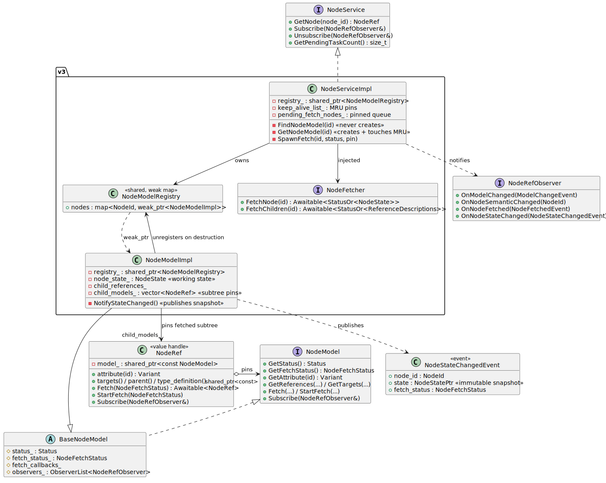
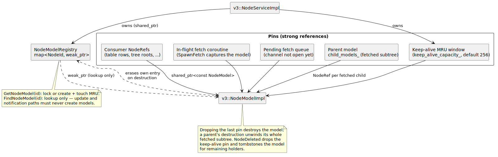
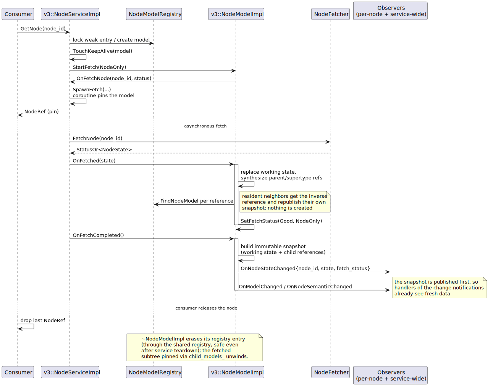

# NodeService Design

`common/node_service/` provides the client-side facade over the OPC UA
address space: consumers browse, read, and observe nodes through it without
talking to the remote services directly. It is used by the desktop client's
UI models (tables, trees, property panels) and by shared subsystems such as
`timed_data`.

This document describes the abstractions, the bounded-residency ownership
model, and the immutable-snapshot event channel introduced with the v3
implementation.

## Core abstractions



*Source: [diagrams/node_service_classes.puml](diagrams/node_service_classes.puml)*

| Type | Header | Role |
|---|---|---|
| `NodeService` | `node_service/node_service.h` | Entry point: `GetNode`, service-wide `Subscribe`/`Unsubscribe`, pending-task count. |
| `NodeRef` | `node_service/node_ref.h` | Copyable value handle over `shared_ptr<const NodeModel>`. Attribute reads, graph navigation (`targets()`, `parent()`, `type_definition()`, `operator[]`), lazy fetch (`Fetch`/`StartFetch`), per-node subscription. **Holding a `NodeRef` is what keeps a node resident.** |
| `NodeModel` | `node_service/node_model.h` | Virtual per-node interface behind `NodeRef`; implemented per service variant. |
| `BaseNodeModel` | `node_service/base_node_model.h` | Shared fetch-status/callback/observer machinery (re-entrancy-safe callback drain). |
| `NodeRefObserver` | `node_service/node_observer.h` | Notification interface: `OnModelChanged`, `OnNodeSemanticChanged`, `OnNodeFetched`, `OnNodeStateChanged` (all default no-op). |
| `scada::NodeState` / `NodeStatePtr` | `common/node_state.h` | Plain node data (attributes, properties, references). `NodeStatePtr = shared_ptr<const NodeState>` is the immutable snapshot type. |
| `NodeFetchStatus` | `node_service/node_fetch_status.h` | Which fetch level a node has reached (`node_fetched`, `children_fetched`). |

All implementations are executor-affine: a service and its models must be
used from the executor they were created on. Cross-executor use goes through
`ProxyNodeService`.

## Implementation variants

| Variant | Directory | Data source | Notes |
|---|---|---|---|
| **v3** | `node_service/v3/` | Injected `NodeFetcher` coroutine facade | The active implementation. Bounded residency + snapshot publication (below). |
| v2 | `node_service/v2/` | `ViewService`/`AttributeService` via `NodeFetcherImpl` | Direct `NodeState` cache per model; `PendingEvents` batching. Unbounded model cache. |
| v1 | `node_service/v1/` | Mirrors into a local `scada::AddressSpace` | Models read from `scada::Node*`. Legacy. |
| static | `node_service/static/` | Preloaded `NodeState`s | Immutable test/config data; `Subscribe` is a no-op. |
| proxy | `node_service/proxy/` | Wraps another `NodeService` | Cross-executor marshaling; read methods are currently stubs. |

`node_service_unittests` links v1+v2+v3+proxy together and runs the shared
suites against them.

## v3 residency model: load the minimal subgraph, release what is unused

Design goal: the service must not accumulate every node ever browsed.
Fetching loads only what was asked for, and dropping the last reference to a
subtree releases it.



*Source: [diagrams/node_service_residency.puml](diagrams/node_service_residency.puml)*

Ownership rules:

- **The registry is weak.** `v3::NodeServiceImpl` tracks models in a
  `NodeModelRegistry` (`map<NodeId, weak_ptr<NodeModelImpl>>`) shared between
  the service and every model. A model erases its own entry on destruction —
  through the shared registry, so a `NodeRef` released after service teardown
  stays safe.
- **Pins are the only ownership.** A model stays alive while at least one of
  these holds it:
  - a consumer `NodeRef` (UI rows, tree roots, captured coroutine locals);
  - an in-flight fetch (`SpawnFetch` captures the model, so a transient
    `GetNode` cannot lose its own fetch mid-flight), including fetches queued
    while the channel is closed (`pending_fetch_nodes_`);
  - the parent model's `child_models_` — after a children fetch the parent
    pins every fetched child and its reference type, so a fetched subtree
    lives exactly as long as its root, and dropping the root unwinds it;
  - the bounded keep-alive MRU window
    (`NodeServiceImplContext::keep_alive_capacity_`, default 256), which
    absorbs refetch churn from transient traversal patterns.
- **Update paths never create models.** `FindNodeModel` (lookup-only) is used
  for fetch results, fetch errors, remote event routing, and the
  inverse-reference push into neighbors; only `GetNode`/`GetNodeModel`
  create. Fetching one node therefore does not materialize its reference
  neighborhood.
- **Deletion evicts.** A remote `NodeDeleted` event tombstones the resident
  model (`Bad_WrongNodeId`, per-node observers notified), releases its
  subtree pins, and drops the service's keep-alive pin. Remaining holders
  keep a valid tombstoned model; once they release it, a later `GetNode`
  starts from a fresh model.
- **Events are decoupled from residency.** Node change subscriptions live in
  the service's `NodeSubscriptionTable` (`node_service/node_subscription_table.h`),
  keyed by node id and materialized only for nodes with a live subscription —
  they are no longer stored on the node model. As a result a subscription no
  longer pins the node's model (or its fetched subtree) resident, and both
  service-wide and per-node observers receive remote
  `ModelChangeEvent`/`SemanticChangeEvent` notifications whether or not the
  node is resident. A subscriber that needs the node's cached state must keep
  it resident by holding its `NodeRef`. This also removes the fixed
  four-`signals2`-signal storage every resident node used to carry regardless
  of whether anyone subscribed.

Diagnostics: `v3::NodeServiceImpl::GetResidentNodeCount()` reports the
current registry size (used by the residency unit tests).

## Snapshot data plane: push-only immutable NodeState

Consumers used to react to a change notification by re-getting the node and
re-reading each attribute through the virtual `NodeModel` interface. v3
additionally publishes immutable snapshots:

- On every state change (first fetch, attribute/property/reference update,
  children-fetch completion) the model builds a **self-contained**
  `scada::NodeState` — working state plus fetched child references — wraps it
  in a `NodeStatePtr`, and fires
  `NodeRefObserver::OnNodeStateChanged{node_id, state, fetch_status}` to
  per-node and service-wide observers.
- Published snapshots are **never mutated**; holders keep a frozen,
  internally consistent view for as long as they need it, and may hand the
  pointer across executor boundaries without pinning the model.
- The channel is deliberately **push-only**: there is no pull accessor on
  `NodeModel`/`NodeRef`. Synchronous reads stay on the `NodeRef` attribute
  getters; a subscriber sees a snapshot on the node's next publication.
- Publications ride the fetch batching (`pending_state_changed_` +
  `OnFetchCompleted`), so one fetch batch produces at most one snapshot per
  node, and the snapshot is published **before** `OnModelChanged`/
  `OnNodeSemanticChanged`, so handlers of those notifications already see
  fresh data.
- When a fetched node's references land, resident **neighbors** receive the
  inverse reference in their working state and republish their own snapshot;
  unfetched neighbors publish nothing (their working state is replaced
  wholesale when their own fetch completes).



*Source: [diagrams/node_service_fetch_sequence.puml](diagrams/node_service_fetch_sequence.puml)*

## Testing

- `node_service/node_service_unittest.cpp` — typed suites across
  implementations, plus v3-specific residency and snapshot tests
  (`V3NodeServiceTest`, `V3KeepAliveTest`).
- `node_service/test/recording_node_observer.h` — shared fake observer that
  records received notifications; v3 tests assert on recorded event
  sequences rather than mock call-shape expectations.
- Residency tests run with `keep_alive_capacity = 0` so release is purely
  refcount-driven; keep-alive behavior is tested with a small non-zero
  window.

## Regenerating the diagrams

Diagram sources are PlantUML files next to their rendered SVGs in
`docs/diagrams/`. Regenerate after editing (keep the explicit white
background so diagrams stay readable on dark pages):

```shell
cd common/docs/diagrams
plantuml -tsvg node_service_classes.puml node_service_residency.puml \
    node_service_fetch_sequence.puml
```

Commit the `.puml` sources and the regenerated `.svg` artifacts together.
