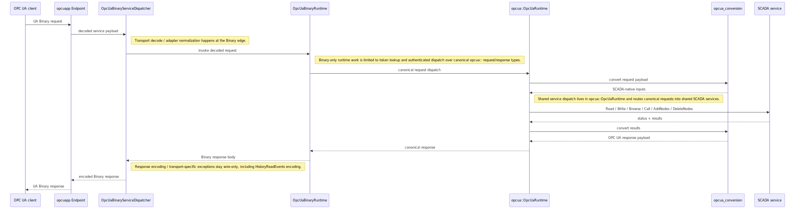
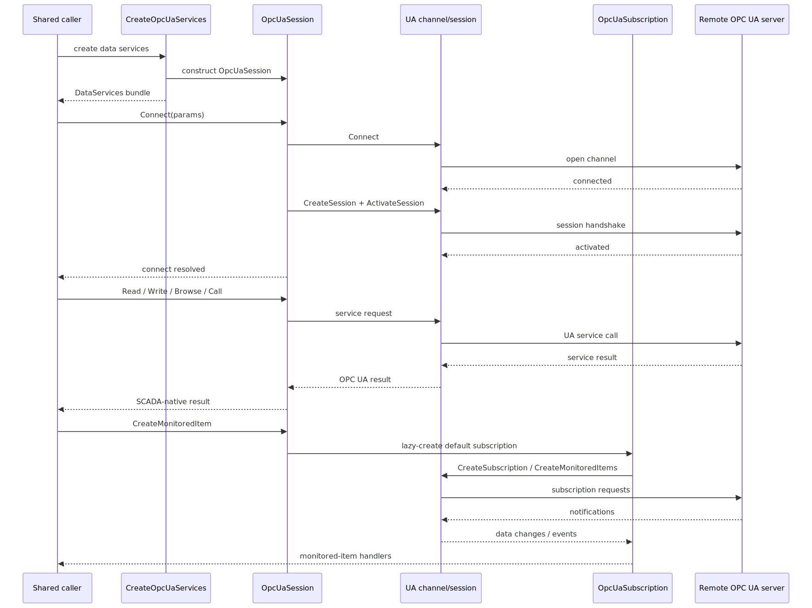
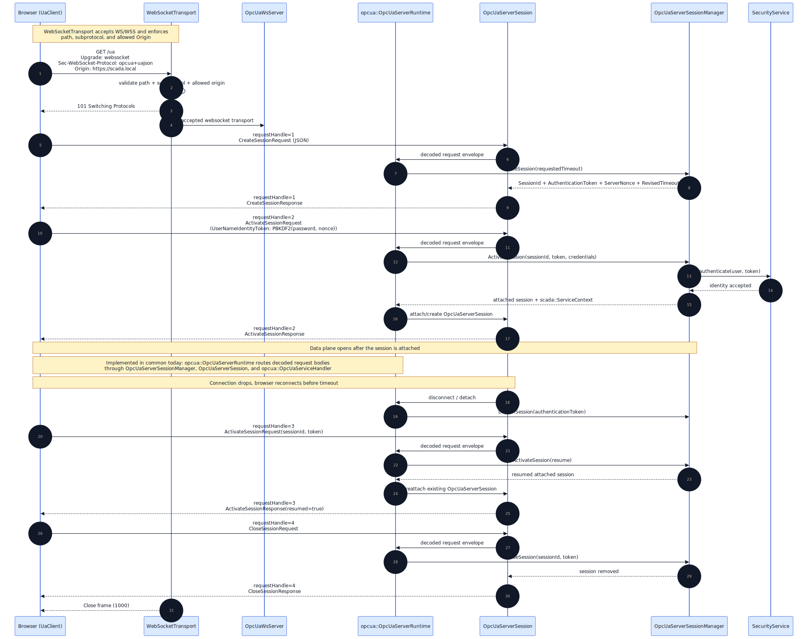
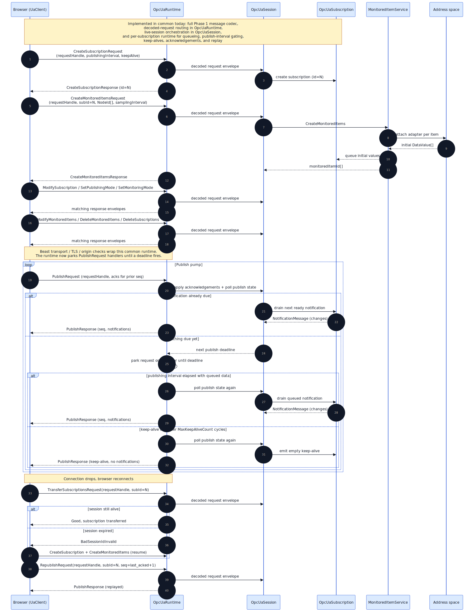

# OPC UA Module and Endpoint Design

The server exposes two sibling OPC UA transport adapters over the same
semantic core in `common/opcua/`: a classic `opc.tcp://` UA Binary endpoint
and a browser-facing `opc.ws://` / `opc.wss://` UA-JSON WebSocket endpoint.
Binary-specific framing, secure-channel handling, and request adaptation live
under `common/opcua/binary/`. WebSocket handshake, UA-JSON envelopes, origin
policy, and text-frame transport adaptation live under
`common/opcua/websocket/`. Session lifecycle, subscription ownership, publish
arbitration, request routing, and coroutine-based service dispatch live in
the shared `opcua::` runtime under `common/opcua/`.

JSON field casing follows OPC UA naming for service bodies: PascalCase body
fields inside a camelCase transport envelope (`requestHandle`, `service`,
`body`).

## Related documents

- [./overview.md](./overview.md) — broader common-library index
- [../README.md](../README.md) — top-level common-library overview
- [../../server/docs/design.md](../../server/docs/design.md) — overall server architecture
- [../../server/docs/opcua_module.md](../../server/docs/opcua_module.md) —
  server-side module wiring, config loading, and lifecycle
- `server/opcua/opcua_module.cpp` + `common/opcua/binary/opcua_binary_server.{h,cpp}`
  — the existing `opc.tcp://` endpoint that this module sits next to
- [../../web/docs/design.md](../../web/docs/design.md) — the web client that
  is the primary consumer of this endpoint
- [../../web/docs/opcua-client.md](../../web/docs/opcua-client.md) — the
  browser-side TS OPC UA client library and wire-format counterpart

## Diagrams

### Shared module overview



Source: [opcua_module_overview.mmd](./diagrams/opcua_module_overview.mmd)

### Shared server request flow



Source: [opcua_server_request_flow.mmd](./diagrams/opcua_server_request_flow.mmd)

### Client session flow



Source: [opcua_client_session_flow.mmd](./diagrams/opcua_client_session_flow.mmd)

### Component diagram



Source: [opcua_component_diagram.mmd](./diagrams/opcua_component_diagram.mmd)

### Module architecture



Source: [opcua_architecture.mmd](./diagrams/opcua_architecture.mmd)

### Session lifecycle



Source: [opcua_session_sequence.mmd](./diagrams/opcua_session_sequence.mmd)

### Subscription and publish loop



Source: [opcua_subscription_sequence.mmd](./diagrams/opcua_subscription_sequence.mmd)

## Purpose

The shared `common/opcua/` module supplies the canonical OPC UA core used by
both server-side transport adapters and by the project's outbound UA client
integration:

- server-side endpoint hosting through `OpcUaModule`, `OpcUaBinaryServer`, and
  the WS adapter stack under `common/opcua/websocket/`
- client-side outbound UA sessions through `OpcUaSession`
- conversion between OPC UA C-stack types and SCADA-native service types
- monitored-item and event subscription bridging
- a `DataServicesFactory` adapter that exposes an outbound UA session as the
  standard SCADA service interfaces
- the canonical transport-neutral OPC UA request/response and coroutine
  service-dispatch model reused by both the Binary and WS server adapters

At runtime it sits between:

- the in-repo native UA Binary client stack under
  `common/opcua/binary/client/` (Transport → SecureChannel → Channel →
  Session → Subscription). No external OPC UA SDK is linked: codec,
  framing, secure-channel and service dispatch are all implemented here
  against the OPC Foundation type schema
  (<https://files.opcfoundation.org/schemas/UA/1.04/Opc.Ua.Types.bsd.xml>).
  See the architecture diagram at
  `common/docs/diagrams/opcua_binary_client_architecture.svg`.
- the shared SCADA service interfaces such as `AttributeService`,
  `ViewService`, `MethodService`, and `MonitoredItemService`
- the server module in `server/opcua/`
- client-side callers that want to talk to a remote OPC UA endpoint through
  the same service abstractions used elsewhere in the codebase

## Main components

### `OpcUaModule` / `OpcUaBinaryServer`

Files:

- `server/opcua/opcua_module.cpp`
- `common/opcua/binary/opcua_binary_server.h`
- `common/opcua/binary/opcua_binary_server.cpp`

Server-side TCP listener and connection host for the transport-backed OPC UA
binary runtime.

Responsibilities:

- parse and validate the `opc.tcp://` endpoint configuration
- open and close the passive TCP listener
- host the UA binary frame server on accepted transports
- wire the listener to the shared `opcua::OpcUaBinaryRuntime`

Business logic, session state, and service dispatch live below this layer in
the shared runtime model rather than in a transport-specific server bridge.

### Native UA Binary client stack

Files:

- `common/opcua/binary/client/opcua_binary_client_transport.{h,cpp}`
- `common/opcua/binary/client/opcua_binary_client_secure_channel.{h,cpp}`
- `common/opcua/binary/client/opcua_binary_client_channel.{h,cpp}`
- `common/opcua/binary/client/opcua_binary_client_session.{h,cpp}`
- `common/opcua/binary/client/opcua_binary_client_subscription.{h,cpp}`

Five-layer in-repo OPC UA Binary client, sibling to the server-side runtime
already in `common/opcua/binary/`. Coroutine-native throughout
(`Awaitable<scada::Status>` / `Awaitable<scada::StatusOr<T>>` at every
layer). See `common/docs/diagrams/opcua_binary_client_architecture.svg`
for the component graph.

Security support in this revision: `SecurityPolicy=None` /
`SecurityMode=None`. `Basic256Sha256` sign-and-encrypt is tracked as a
follow-up and will plug into `OpcUaBinaryClientSecureChannel` without
changing the surface above it.

### `OpcUaSession`

Files:

- `common/opcua/opcua_session.h`
- `common/opcua/opcua_session.cpp`

Qt-client-facing adapter that implements the shared SCADA service
interfaces (`SessionService`, `ViewService`, `AttributeService`,
`MonitoredItemService`, `MethodService`) on top of the native client stack
above.

Responsibilities:

- parse the `opc.tcp://host:port` endpoint from `SessionConnectParams` and
  construct a `transport::any_transport` via `TransportFactory`
- build the native client stack and drive
  `OpcUaBinaryClientSession::Create()` (transport.Connect →
  SecureChannel.Open → CreateSession → ActivateSession)
- bridge each service method: `CoSpawn` the matching
  `OpcUaBinaryClientSession` coroutine and invoke the legacy callback /
  promise when the awaitable resolves
- fan `session_state_changed` transitions out through
  `boost::signals2`

### `OpcUaSubscription`

Files:

- `common/opcua/opcua_subscription.h`
- `common/opcua/opcua_subscription.cpp`

Qt-client-facing monitored-item manager layered on a single
`OpcUaBinaryClientSubscription`.

Responsibilities:

- create the server-side subscription lazily on first
  `CreateMonitoredItem`
- drive a background Publish loop that calls
  `OpcUaBinaryClientSubscription::Publish()` until the session closes,
  dispatching each data-change notification to the matching
  `scada::DataChangeHandler`
- add and remove monitored items against the server through the
  subscription

### `OpcUaMonitoredItem`

Files:

- `common/opcua/opcua_monitored_item.h`
- `common/opcua/opcua_monitored_item.cpp`

`scada::MonitoredItem` instance returned from
`OpcUaSession::CreateMonitoredItem`. Holds a back-reference to the
subscription plus the client-local id. `Subscribe(handler)` registers the
handler; destruction removes the item from the server.

### Shared server runtime model

Files:

- `common/opcua/opcua_message.h`
- `common/opcua/opcua_service_message.h`
- `common/opcua/opcua_service_handler.{h,cpp}`
- `common/opcua/opcua_server_session_manager.{h,cpp}`
- `common/opcua/opcua_server_session.{h,cpp}`
- `common/opcua/opcua_server_subscription.{h,cpp}`
- `common/opcua/opcua_runtime.{h,cpp}`
- `common/opcua/websocket/opcua_ws_runtime.h`

Canonical server-side request/response and service-dispatch contract used by
both the UA Binary adapter and the UA-JSON/WebSocket adapter.

### `CreateOpcUaServices(...)`

File:

- `common/opcua/opcua_services_factory.cpp`

Factory adapter that exposes one outbound `OpcUaSession` through the shared
`DataServices` bundle.

Responsibilities:

- construct `OpcUaSession`
- publish that session as the `session`, `view`, `attribute`, `method`, and
  `monitored-item` service surface
- shield callers from `OpcUaSession` construction failures

## Motivation

The project now has two server-facing OPC UA transport surfaces:

- `opc.tcp://` for native OPC UA clients and the existing desktop integration
- `opc.ws://` / `opc.wss://` for browser clients using UA-JSON over WebSocket

Those endpoints must stay semantically aligned. Address-space reads, writes,
browse behavior, session lifecycle, subscriptions, history, events, and
security decisions should not diverge just because the wire format changes.

The design therefore keeps Binary and WS as **sibling transport adapters**
around one shared runtime. Binary owns UACP, UA Binary framing, secure-channel
integration, and binary request/response adaptation. WS owns HTTP upgrade,
origin policy, websocket transport, UA-JSON envelopes, and WSS/TLS wrapping.
Everything semantic stays in the shared `common/opcua/` core.

## Transport summary

| Transport | Main consumer | Adapter boundary | Wire format |
|---|---|---|---|
| `opc.tcp://` | Qt/native/3rd-party OPC UA clients | `common/opcua/binary/` | UA Binary over UACP/TCP |
| `opc.ws://` / `opc.wss://` | Browser/web client | `common/opcua/websocket/` | UA-JSON over WebSocket |

## Transport choice: UA-JSON over WebSocket

Subprotocol: `opcua+uajson`. This is the JSON WebSocket mapping defined in
OPC UA Part 6 §5.4 (Reversible JSON Encoding) and §7.4 (WebSocket transport
mapping).

Chosen over UA Binary over WS (`opcua+uacp`) because:

- **Browser feasibility.** A UA Binary encoder/decoder in the browser has to
  cover every Variant type, ExtensionObject, NodeId encoding, and secure-channel
  chunking. That is weeks of TypeScript plus a WASM UA stack. UA-JSON is
  parseable with built-in `JSON.parse`; the reversible-JSON schema lets us
  hand-roll a focused encoder/decoder in ~2 k lines.
- **Debuggability.** JSON frames are inspectable in Chrome DevTools and in
  packet captures. UA binary is opaque without a dissector.
- **Closed loop.** Both endpoints are ours. We are not trying to interoperate
  with arbitrary UA clients on the WS endpoint; the TCP endpoint stays there
  for anything that needs binary.

Tradeoff accepted: JSON payloads are larger. We mitigate with websocket
`permessage-deflate`, which typically recovers most of the gap on repetitive
`DataValue` traffic.

## Placement

The shared OPC UA implementation is split into transport adapters plus a
transport-neutral semantic core:

| Path | Role |
|---|---|
| `common/opcua/binary/opcua_binary_server.{h,cpp}` | Accepted-transport UA Binary server loop for the `opc.tcp://` endpoint |
| `common/opcua/binary/opcua_binary_runtime.{h,cpp}` | Binary adapter runtime: request decode / response encode, secure-channel/session-token lookup, and authenticated dispatch into the canonical `opcua::` request/response model |
| `common/opcua/binary/opcua_binary_service_dispatcher.{h,cpp}` | Binary adapter boundary for request-header adaptation and Binary-only response encoding details |
| `third_party/net/transport/websocket_transport.{h,cpp}` | Concrete websocket boundary for WS/WSS server and client transports: validates HTTP upgrade policy through callbacks, supports TLS/WSS from in-memory PEM certificate/key buffers, enables `permessage-deflate`, exposes accepted websocket sessions as message-oriented transports, and reports the bound listener endpoint |
| `common/opcua/websocket/opcua_ws_server.{h,cpp}` | Message-oriented accept/session loop over `transport::any_transport`: reads JSON frames, decodes canonical `opcua::OpcUaRequestMessage` UA-JSON envelopes, forwards canonical request bodies into `opcua::OpcUaRuntime`, writes canonical `opcua::OpcUaResponseMessage` envelopes, and detaches sessions on disconnect |
| `common/opcua/opcua_server_session.{h,cpp}` | Canonical transport-independent live session state owned by `opcua::OpcUaSession` |
| `common/opcua/opcua_runtime.{h,cpp}` + `common/opcua/websocket/opcua_ws_runtime.h` | Canonical shared runtime plus the remaining WS convenience wrapper: transport-neutral request-body routing, shared connection state, and session/subscription ownership tracking |
| `common/opcua/opcua_server_session_manager.{h,cpp}` | Canonical transport-independent session lifecycle, resume/detach timeout handling, and auth-policy enforcement |
| `common/opcua/opcua_server_subscription.{h,cpp}` | Canonical `opcua::OpcUaSubscription` publish queue, keep-alive timer, and data-change delivery |
| `common/opcua/websocket/opcua_json_codec.{h,cpp}` | UA-JSON encode/decode over `boost::json`; consumes and produces the canonical `opcua::` request/response/envelope types, and reuses `common/opcua/opcua_conversion.{h,cpp}` for UA ↔ scada conversion |
| `common/opcua/opcua_message.h` + `common/opcua/opcua_service_message.h` | Canonical transport-neutral OPC UA request/response model used by both Binary and WS adapters, with Binary `OpcUaBinary*Body` spellings retained as aliases at the adapter edge |
| `common/opcua/websocket/opcua_ws_message_codec.cpp` + `common/opcua/websocket/opcua_ws_subscription_message_codec.cpp` + `common/opcua/websocket/opcua_ws_publish_message_codec.cpp` | UA-JSON codec for the outer `requestHandle` / `service` / `body` envelope and the subscription / publish / monitored-item payloads, implemented directly against the canonical `opcua::` message model |
| `common/opcua/opcua_service_handler.{h,cpp}` | Canonical coroutine-based dispatch from transport-neutral service requests into existing `AttributeService`, `ViewService`, `HistoryService`, `MethodService`, and `NodeManagementService`, now routed through the shared `core/scada/service_awaitable.h` helpers rather than a second local callback-bridge layer |
| `common/opcua/websocket/*_unittest.cpp` | Codec golden fixtures, session lifecycle, subscription publish/ack, service-dispatch coverage, and the WS instantiation of the shared runtime contract suite from `common/opcua/opcua_runtime_contract_test.h`; the envelope/runtime/server tests exercise the canonical `opcua::` message and session types directly |
| `common/opcua/binary/*_unittest.cpp` | Binary adapter coverage for request decoding, response encoding, secure-channel/session integration, and the Binary execution of the shared runtime contract where applicable |
| `server/opcua/opcua_module.{h,cpp}` | Config loader + lifecycle for both TCP and WS listeners |

Both transport adapters reuse the same `OpcUaServerContext` service
collaborators:

- `AttributeService` — Read, Write, HistoryRead
- `ViewService` — Browse, BrowseNext, TranslateBrowsePathsToNodeIds
- `MonitoredItemService` — CreateMonitoredItems, subscription delivery
- `MethodService` — Call
- `NodeManagementService` — AddNodes, DeleteNodes, AddReferences, DeleteReferences

No business logic is reimplemented in the adapter layers.

- Binary is decode UA Binary / request header adaptation / secure-channel
  state lookup -> canonical `opcua::` request -> shared runtime/service
  handler -> Binary response adaptation / encoding
- WS is decode UA-JSON envelope -> canonical `opcua::` request -> shared
  runtime/service handler -> UA-JSON response envelope encode

## Adapter boundaries

Binary and WS are sibling transport adapters around the same semantic runtime.

- `common/opcua/` owns the canonical server runtime and service semantics
- `common/opcua/binary/` owns only UA Binary / UACP / SecureChannel
  adaptation
- `common/opcua/websocket/` owns only UA-JSON/WebSocket/WSS adaptation
- transport-specific differences should stay at the adapter edge; semantic
  fixes should land in the shared core first when they are not wire-specific

This design does not require merging Binary and WS codecs, replacing one
transport with the other, or forcing Binary secure-channel policy and WS
origin/TLS policy into one abstraction. The adapters meet at the canonical
`opcua::` request/response boundary instead.

## Framing

- Boost.Beast `websocket::stream<ssl::stream<tcp::socket>>`.
- TLS handles channel security, so we do **not** run UA `OpenSecureChannel`.
  The WebSocket upgrade is the secure-channel establishment.
- One WebSocket **text** frame carries one UA request or response JSON object
  (Part 6 §7.4 simple framing). In the common-side codec, that frame
  is represented as a transport-neutral envelope with `requestHandle`,
  `service`, and `body`. `requestHandle` correlates responses; `PublishResponse`
  messages are pushed by the server in response to
  outstanding `PublishRequest` messages, same pattern as on TCP.
- Monitored-item startup follows OPC UA Part 4 §5.13.1 and §7.25.2:
  when a monitored item is created in an enabled mode, the server queues the
  current value or status without applying the filter. If no value/status is
  cached yet, the first notification is queued once that initial sample
  becomes available from the source.
- Subscription publish timing follows OPC UA Part 4 §5.14.1.1:
  the publishing cycle starts when the subscription is created, the first
  message is sent at the end of the first publishing cycle, late `Publish`
  requests are processed immediately once a cycle has already expired, and
  keep-alive messages carry the next notification sequence number rather than
  `0`. Disabling publishing suppresses notification messages but does not stop
  keep-alive processing.
- Handshake validates `Sec-WebSocket-Protocol: opcua+uajson` and `Origin`
  against a configured allowlist. This is the cross-site WebSocket hijacking
  (CSWSH) guard — `Origin` is the only signal the browser is honest about for
  same-origin policy on WebSockets.
- Keep-alive: WebSocket ping/pong at 30 s in addition to the UA subscription
  keep-alive. Ping failure triggers `ws::close` with status 1011 and tears
  down the UA session after its normal timeout (so `TransferSubscriptions` on
  reconnect still works if the client races back fast enough).

## JSON field naming

### Rule

In OPC UA JSON encoding, **every JSON object key is the StructureField name
verbatim**, and StructureField / BrowseName text is **PascalCase** by OPC UA
modelling convention. So `CreateSessionRequest`'s body fields are
`SessionName`, `ClientNonce`, `RequestedSessionTimeout`,
`MaxResponseMessageSize`; `ActivateSessionRequest` uses `AuthenticationToken`,
etc.

The same rule applies to envelope wrappers in this module's UA-JSON framing
(`service`, `requestHandle`, `body`) — those are envelope keys we define,
they are not StructureField names and we keep them camelCase. Only the UA
service request/response body field names are governed by the spec casing.

### Spec references

- **OPC UA Part 6 §5.4** — JSON data encoding:
  > The name of field in the JSON object is the name of the field in the
  > `DataTypeDefinition`.
  —
  <https://reference.opcfoundation.org/Core/Part6/v105/docs/5.4>
- **OPC UA Part 6 §5.1.13** — Name encoding rules (characters / escaping;
  does not further lower-case names):
  <https://reference.opcfoundation.org/Core/Part6/v105/docs/5.1.13>
- **OPC UA Part 14 §7.2.3** — PubSub JSON message mapping; concrete field
  examples (`MessageId`, `MessageType`, `PublisherId`, `DataSetWriterId`,
  `SequenceNumber`, `Payload`, `Timestamp`) all PascalCase:
  <https://reference.opcfoundation.org/Core/Part14/v104/docs/7.2.3>
- **OPC UA Part 4 §5.6.2** — `CreateSessionRequest` struct definition:
  `ClientDescription`, `ServerUri`, `EndpointUrl`, `SessionName`,
  `ClientNonce`, `ClientCertificate`, `RequestedSessionTimeout`,
  `MaxResponseMessageSize`:
  <https://reference.opcfoundation.org/Core/Part4/v105/docs/5.6.2>
- **UA Modelling Best Practices §2 — Naming Conventions**, which defines
  the PascalCase rule for BrowseNames and StructureField names:
  <https://reference.opcfoundation.org/Model-Best/v102/docs/2>
- Reference implementations cross-check:
  - node-opcua JSON examples use PascalCase:
    <https://node-opcua.github.io/api_doc/0.1.0/classes/CreateSessionRequest.html>

### Behavior

- **Message codecs
  (`common/opcua/websocket/opcua_ws_message_codec.cpp`,
  `opcua_ws_subscription_message_codec.cpp`,
  `opcua_ws_publish_message_codec.cpp`)** encode and decode PascalCase UA
  body fields such as `"AuthenticationToken"`,
  `"RequestedSessionTimeout"`, `"SessionId"`, `"ServerNonce"`,
  `"SubscriptionId"`, `"Results"`, and the related monitored-item /
  notification field names.
- **Codec unit tests**
  (`common/opcua/websocket/opcua_json_codec_unittest.cpp`) check PascalCase session
  field names explicitly.
- **Server integration tests**
  (`server/opcua/opcua_module_unittest.cpp`) send raw PascalCase
  `CreateSession` / `ActivateSession` JSON over a live websocket connection.
- **Envelope keys (`service`, `requestHandle`, `body`)** remain camelCase;
  they are module-defined framing keys, not UA StructureField names.

### UA-JSON service shape

- Service response `Status` values are encoded as raw JSON numbers, matching
  the OPC UA `StatusCode` wire form. The decoders still accept the older
  `{ "fullCode": N }` shape for compatibility.
- `Read`, `Write`, `Browse`, and `TranslateBrowsePathsToNodeIds` use the
  spec request fields `NodesToRead`, `NodesToWrite`, `NodesToBrowse`, and
  `BrowsePaths`.
- `Read` now rewrites internal `Bad_WrongNodeId` item failures to the OPC UA
  wire status `Bad_NodeIdUnknown` (`0x80340000`) so browser clients see a
  standard NodeId error code.
- `Call` uses `MethodsToCall` / `InputArguments`, and `CallResponse`
  result entries use `StatusCode`, `InputArgumentResults`, and
  `OutputArguments`.
- Node-management requests use `NodesToAdd`, `NodesToDelete`,
  `ReferencesToAdd`, `ReferencesToDelete`, and `IsForward`.
- `BrowseResult.ContinuationPoint` is omitted when empty instead of being
  emitted as an empty JSON value.

## Authentication

On `ActivateSessionRequest`, `opcua::OpcUaSession` constructs the same
`scada::ServiceContext` the TCP endpoint constructs. Identity tokens
supported here:

- `AnonymousIdentityToken` — accepted only when the server is configured for
  anonymous access.
- `UserNameIdentityToken` — password is delivered as
  `PBKDF2-SHA-256(password, server_nonce)` per the UA spec. TLS already
  protects the channel; the PBKDF layer prevents regressions when someone
  disables TLS in a dev environment and also matches what native UA clients
  send.

The server-side auth path (`server/security/`) is unchanged.

## Configuration

Add an `opcua_ws` block to both `server/data/server.json` and
`server/docker/server.json`:

```jsonc
"opcua_ws": {
  "enabled": true,
  "url": "opc.wss://0.0.0.0:4843",
  "server_private_key": "${DIR_PARAM}/Certificates/ServerPrivateKey.pem",
  "server_certificate": "${DIR_PARAM}/Certificates/ServerCertificate.pem",
  "allowed_origins": ["http://localhost:5173"],
  "subprotocol": "opcua+uajson",
  "max_message_size": 4194304,
  "compression": true,
  "trace": "warning"
}
```

Notes:

- Port `4843` is the UA spec's recommendation for WSS. Keeping the TCP
  endpoint on `4840` means both can run simultaneously.
- `allowed_origins` defaults to an empty list — that is, deny by default in
  prod. Explicit `"*"` is accepted for lab setups but logs a warning at
  startup.
- TLS cert paths intentionally match the transport OPC UA endpoint config even
  though SecureChannel policy handling is still pending.
- `max_message_size` bounds both directions; over-large messages close the
  socket with status 1009.

## Service coverage

The WS endpoint maps the following UA services to browser-facing features in
the [web client roadmap](../../web/docs/roadmap.md).

| Group | UA services on WS | Drives web feature |
|---|---|---|
| Session and browse | `CreateSession`, `ActivateSession`, `CloseSession`, `Read`, `Write`, `Browse`, `BrowseNext`, `TranslateBrowsePathsToNodeIds` | Login, address-space tree, timer-polled watch |
| Subscriptions | `CreateSubscription`, `ModifySubscription`, `SetPublishingMode`, `Publish`, `Republish`, `DeleteSubscriptions`, `TransferSubscriptions`, `CreateMonitoredItems`, `ModifyMonitoredItems`, `SetMonitoringMode`, `DeleteMonitoredItems` | Subscription-driven watch, event journal, alarms |
| History and methods | `HistoryRead` (raw + events), `Call` | Trend graphs, method-based control commands |
| Node management | `AddNodes`, `DeleteNodes`, `AddReferences`, `DeleteReferences` | Bulk create, configuration table editors |

The shared module provides:

- transport-neutral service dispatch in `common/opcua/opcua_service_handler.{h,cpp}`
- session lifecycle in `common/opcua/opcua_server_session_manager.{h,cpp}`
- live session state, browse continuation handling, and subscription ownership
  in `common/opcua/opcua_server_session.{h,cpp}`
- per-subscription publish, retransmit, and monitored-item delivery in
  `common/opcua/opcua_server_subscription.{h,cpp}`
- decoded-request routing in `common/opcua/opcua_runtime.{h,cpp}`
- websocket request/response, session, subscription, and publish codecs in
  `common/opcua/websocket/opcua_ws_message_codec.cpp`,
  `opcua_ws_subscription_message_codec.cpp`, and
  `opcua_ws_publish_message_codec.cpp`
- message-oriented WS server dispatch in
  `common/opcua/websocket/opcua_ws_server.{h,cpp}`
- WS/WSS transport and handshake policy in
  `third_party/net/transport/websocket_transport.{h,cpp}`

## Test strategy

### Codec

`common/opcua/websocket/opcua_json_codec_unittest.cpp`

Golden-fixture tests for `Variant`, `NodeId`, `ExpandedNodeId`,
`QualifiedName`, `LocalizedText`, `DataValue`, and request/response pairs for
session, browse, subscription, publish, history, method, and node-management
flows, all wrapped in the WS request/response envelope with `requestHandle`.
`ServiceFault` is also covered, and `Variant` `ExtensionObject` values
round-trip opaquely via `{typeId, body}`.

### Session lifecycle

`common/opcua/websocket/opcua_ws_session_manager_unittest.cpp`

- Create → Activate → Close happy path
- Anonymous activate uses revised timeout without invoking authentication
- Activate without prior Create → `Bad_SessionIsLoggedOff`
- Session timeout expiry without Activate → session cleaned up
- `DetachSession` + `ActivateSession` with valid token → resumes
- `ActivateSession` with expired session → `Bad_SessionIsLoggedOff`
- Single-session identities require `deleteExisting=true` to replace an
  existing active session

### In-process integration

`common/opcua/websocket/opcua_ws_service_handler_unittest.cpp`

Covers the coroutine dispatch layer for:

- `Read`
- `Write`
- `Browse`
- `TranslateBrowsePathsToNodeIds`
- `HistoryReadRaw`
- `HistoryReadEvents`
- `Call`
- `AddNodes`
- `DeleteNodes`
- `AddReferences`
- `DeleteReferences`

`common/opcua/websocket/opcua_ws_subscription_unittest.cpp`

Covers the transport-independent per-subscription runtime for:

- data-change publish delivery
- publishing-interval gating before data/keep-alive delivery
- acknowledgement and `Republish` replay behavior
- keep-alive generation
- publishing-disabled queue retention
- event-field projection from event filters
- monitored-item rebind/delete safety against stale callbacks

`common/opcua/websocket/opcua_ws_session_unittest.cpp`

Covers the transport-independent live-session runtime for:

- subscription creation and deletion
- monitored-item request routing
- browse continuation-point paging and `BrowseNext` release/resume
- round-robin publish arbitration across subscriptions
- acknowledgement aggregation and `Republish`
- keep-alive priming at the session layer
- in-memory `TransferSubscriptions` ownership handoff

`common/opcua/websocket/opcua_ws_runtime_unittest.cpp`

Covers the transport-independent decoded-request runtime for:

- envelope routing through activated sessions
- `Browse` paging and `BrowseNext` continuation-point routing
- parked `PublishRequest` wake-up on keep-alive deadline
- detach/resume preserving live subscription state
- `TransferSubscriptions` via global subscription ownership
- `CloseSession` removing live runtime state

`common/opcua/websocket/opcua_ws_server_unittest.cpp`

Covers the message-oriented server loop for:

- request decode / runtime dispatch / response encode
- malformed JSON mapping to `ServiceFault`
- disconnect-driven session detach and later resume
- acceptor open/close lifecycle

`common/opcua/websocket/opcua_ws_websocket_server_unittest.cpp`

Builds `OpcUaWsServer` on top of a loopback `transport::WebSocketTransport`
listener with an in-memory runtime fixture, opens Beast WebSocket clients over
both plain WS and TLS/WSS, validates the browser-facing handshake policy
(`Origin`, `Sec-WebSocket-Protocol`), and drives the session + browse
paging flow end-to-end. No browser and no `server.exe` launch. This is the
test that catches regressions in the message dispatch and the real websocket
integration.

`common/opcua/websocket/opcua_ws_tls_context_unittest.cpp`

Covers focused TLS certificate bootstrapping for:

- valid in-memory PEM certificate + key loading
- invalid certificate rejection
- invalid private-key rejection

## Out of scope

- UA Binary over WebSocket (`opcua+uacp`). Could be added later as a third
  endpoint without changing this design; there is no browser-facing need for
  it in this design.
- UA Discovery (`FindServers`, `GetEndpoints`) over JSON. Hardcode endpoint
  details in the web client; revisit if a non-browser UA client
  starts consuming the WS endpoint.
- UA SecureChannel over WS. TLS is the channel; we do not layer UA's own
  secure-channel framing on top.
