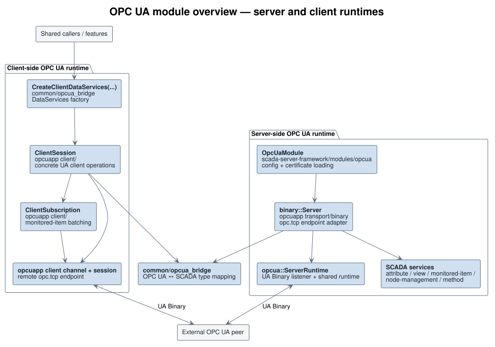
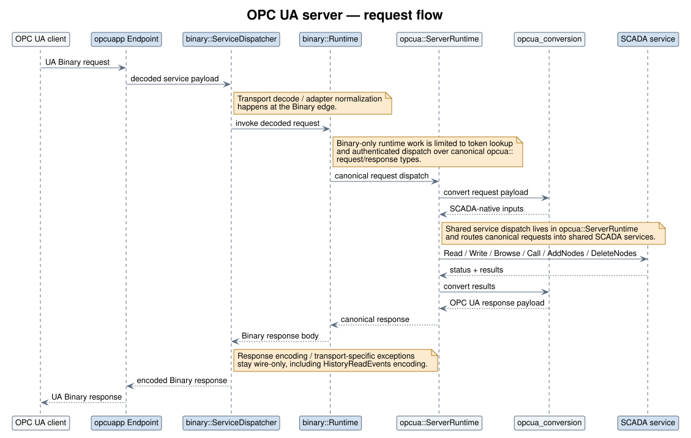
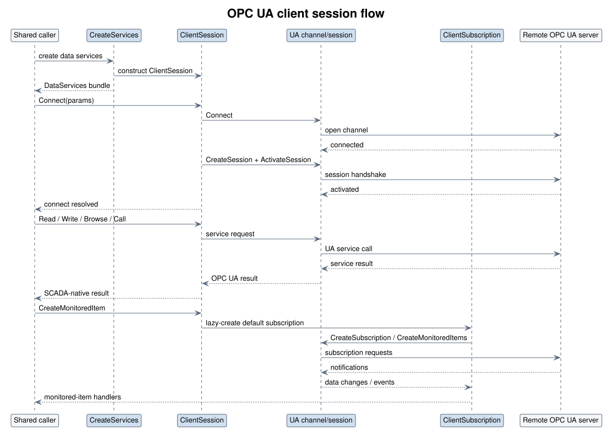
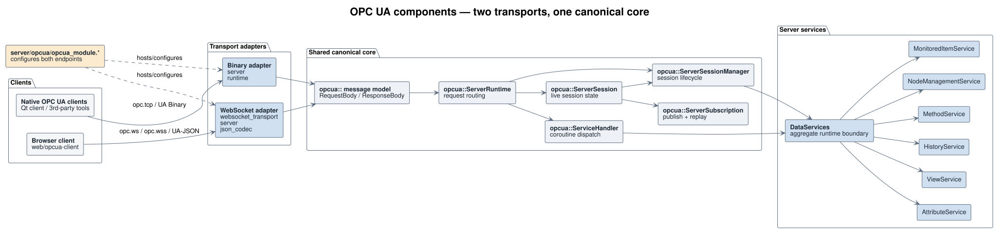
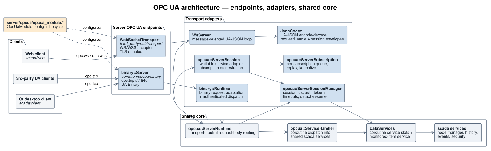
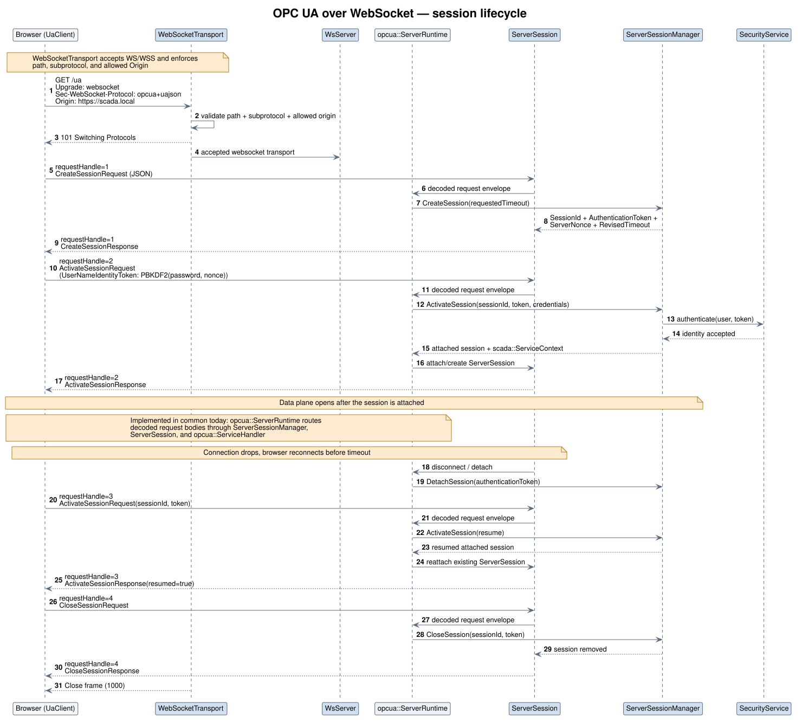
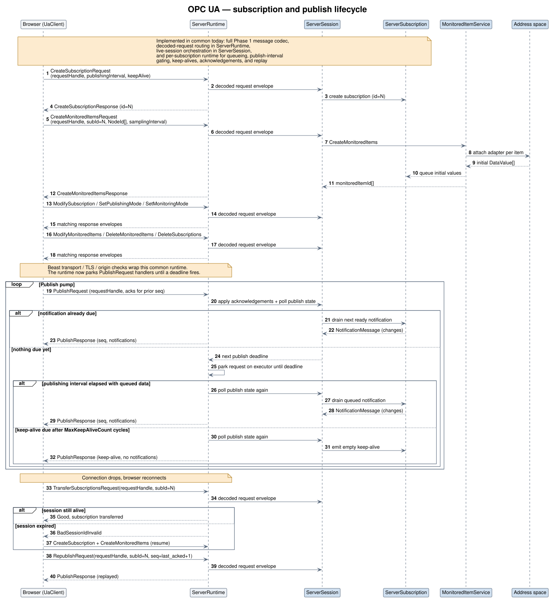

# OPC UA Module and Endpoint Design

Status: Living reference
Last verified against code: 2026-08-02

The server exposes two sibling OPC UA transport adapters over the same
semantic core: a classic `opc.tcp://` UA Binary endpoint and a browser-facing
`opc.ws://` / `opc.wss://` UA-JSON WebSocket endpoint. Binary-specific
framing, secure-channel handling, and request adaptation live under
`third_party/opcuapp/opcua/transport/binary/`. WebSocket handshake, UA-JSON
envelopes, origin policy, and text-frame transport adaptation live under
`third_party/opcuapp/opcua/transport/websocket/`. Session lifecycle,
subscription ownership, publish arbitration, and request routing live in the
shared `opcua::` runtime under `third_party/opcuapp/opcua/session/`;
coroutine-based service dispatch lives in
`third_party/opcuapp/opcua/server/`.

## Where the code lives

**The native OPC UA stack this document describes is no longer in
`common/opcua/` — that directory does not exist.** It was extracted into the
standalone **opcuapp** repo, vendored at `third_party/opcuapp/`. Inside
`common/` the old names survive only as CMake INTERFACE shims —
`scada_core_opcua`, `scada_core_opcua_client` and `scada_common_opcua_ws` in
`common/CMakeLists.txt`, each forwarding to `opcuapp::opcuapp` plus
`scada_opcua_bridge` — so existing consumers keep linking through the same
targets.

Paths in this document are superproject-rooted (the `/scada` checkout) and do
not resolve from a standalone `common/` clone.

| Directory | Contents |
|---|---|
| `third_party/opcuapp/opcua/session/` | Transport-neutral server runtime: `ServerRuntime`, `ServerSessionManager`, `ServerSession`, `ServerSubscription`, and the session/subscription/discovery conversions |
| `third_party/opcuapp/opcua/server/` | `ServiceHandler` — coroutine dispatch from a decoded service request into the application's `ServiceCallbacks` |
| `third_party/opcuapp/opcua/services/` | Service request/response types, `ServiceContext`, `ServiceCallbacks`, operation limits, browse/history/node-attribute conversions |
| `third_party/opcuapp/opcua/monitored/`, `.../events/` | `MonitoredItemSubscription` batch API; event filters, aggregate filters, event projection |
| `third_party/opcuapp/opcua/types/`, `.../ua/` | Hand-written built-in types (NodeId, Variant, DataValue, …) plus the schema-generated UA type and binary/JSON codec set |
| `third_party/opcuapp/opcua/transport/binary/` | UACP framing, secure channel, binary codec, `opc.tcp://` listener |
| `third_party/opcuapp/opcua/transport/websocket/` | UA-JSON envelopes, message-oriented WS server loop, TLS context |
| `third_party/opcuapp/opcua/client/` | Outbound UA client: channel, protocol session/subscription, `ClientSession`, discovery, endpoint selection |

opcuapp is namespaced `opcua::` and knows nothing about `scada::` types.
`common/opcua_bridge/` is the boundary adapter between the two universes; see
[`../opcua_bridge/README.md`](../opcua_bridge/README.md).

JSON field casing follows OPC UA naming for service bodies: PascalCase body
fields inside a camelCase transport envelope (`requestHandle`, `service`,
`body`).

## Related documents

- [./overview.md](./overview.md) — broader common-library index
- [../README.md](../README.md) — top-level common-library overview
- [../../scada-server-framework/docs/design.md](../../scada-server-framework/docs/design.md) — overall server architecture
- [../../scada-server-framework/docs/opcua_module.md](../../scada-server-framework/docs/opcua_module.md) —
  server-side module wiring, config loading, and lifecycle
- `scada-server-framework/modules/opcua/opcua_module.cpp` +
  `third_party/opcuapp/opcua/transport/binary/server.{h,cpp}` — the
  `opc.tcp://` endpoint that this module sits next to
- [../opcua_bridge/README.md](../opcua_bridge/README.md) — the `scada::` ⇄
  `opcua::` boundary adapter
- `third_party/opcuapp/opcua/CLAUDE.md` — how the UA type system and codecs
  are generated from the vendored OPC Foundation schema
- [../../docs/README.md](../../docs/README.md) — the superproject cross-repo
  doc index, which is where the web client's design docs are indexed. The web
  client is the primary consumer of the WS endpoint, and its TypeScript OPC UA
  client library is this wire format's browser-side counterpart.

> This document links through the superproject index rather than into the
> `web/` repo directly: per the superproject `CLAUDE.md` Restrictions,
> `common/` must not take a file dependency on `web/`. Cross-repo relative
> links resolve only in the sibling checkout under `/scada`.

## Diagrams

### Shared module overview



Source: [opcua_module_overview.puml](./diagrams/opcua_module_overview.puml)

### Shared server request flow



Source: [opcua_server_request_flow.puml](./diagrams/opcua_server_request_flow.puml)

### Client session flow



Source: [opcua_client_session_flow.puml](./diagrams/opcua_client_session_flow.puml)

### Component diagram



Source: [opcua_component_diagram.puml](./diagrams/opcua_component_diagram.puml)

### Module architecture



Source: [opcua_architecture.puml](./diagrams/opcua_architecture.puml)

### Session lifecycle



Source: [opcua_session_sequence.puml](./diagrams/opcua_session_sequence.puml)

### Subscription and publish loop



Source: [opcua_subscription_sequence.puml](./diagrams/opcua_subscription_sequence.puml)

## Purpose

The opcuapp module supplies the canonical OPC UA core used by both
server-side transport adapters and by the project's outbound UA client
integration:

- server-side endpoint hosting through `OpcUaModule`, `binary::Server`, and
  the WS adapter stack under
  `third_party/opcuapp/opcua/transport/websocket/`
- client-side outbound UA sessions through `opcua::ClientSession`
- conversion between OPC UA wire types and SCADA-native service types
- monitored-item and event subscription bridging
- `CreateClientDataServices()` in `common/opcua_bridge/client_adapters.{h,cpp}`,
  which exposes an outbound UA session as the standard SCADA `DataServices`
  bundle
- the canonical transport-neutral OPC UA request/response and coroutine
  service-dispatch model reused by both the Binary and WS server adapters

At runtime it sits between:

- the in-repo native UA Binary client stack under
  `third_party/opcuapp/opcua/client/` and
  `third_party/opcuapp/opcua/transport/binary/` (Transport → SecureChannel →
  Connection → Channel → Session → Subscription). No external OPC UA SDK is
  linked: codec, framing, secure-channel and service dispatch are all
  implemented here against the OPC Foundation type schema, which is vendored
  at `third_party/opcuapp/schema/` and code-generated by
  `third_party/opcuapp/tools/gen_ua_types.py` into `opcua/ua/`. See the
  architecture diagram at
  `common/docs/diagrams/opcua_binary_client_architecture.svg`.
- the SCADA service interfaces (`scada::AttributeService`,
  `scada::ViewService`, `scada::MethodService`,
  `scada::MonitoredItemService`, … in `core/scada/`, aggregated by
  `common/common/master_data_services.h`), reached across the
  `common/opcua_bridge/` boundary — opcuapp itself consumes only the flat
  `opcua::ServiceCallbacks` struct
- the server module in `scada-server-framework/modules/opcua/`
- client-side callers that want to talk to a remote OPC UA endpoint through
  the same service abstractions used elsewhere in the codebase

## Main components

### `OpcUaModule` / `binary::Server`

Files:

- `scada-server-framework/modules/opcua/opcua_module.{h,cpp}`
- `third_party/opcuapp/opcua/transport/binary/server.{h,cpp}`

Server-side TCP listener and connection host for the transport-backed OPC UA
binary runtime.

Responsibilities:

- parse and validate the `opc.tcp://` endpoint configuration
- open and close the passive TCP listener
- host the UA binary frame server on accepted transports
- wire the listener to the shared `opcua::binary::Runtime`

Business logic, session state, and service dispatch live below this layer in
the shared runtime model rather than in a transport-specific server bridge.

### Native UA Binary client stack

Files:

- `third_party/opcuapp/opcua/transport/binary/client_transport.{h,cpp}`
- `third_party/opcuapp/opcua/transport/binary/client_secure_channel.{h,cpp}`
- `third_party/opcuapp/opcua/transport/binary/client_connection.{h,cpp}`
- `third_party/opcuapp/opcua/client/client_connection.h` (the transport-neutral
  interface the binary one implements)
- `third_party/opcuapp/opcua/client/client_channel.{h,cpp}`
- `third_party/opcuapp/opcua/client/client_protocol_session.{h,cpp}`
- `third_party/opcuapp/opcua/client/client_protocol_subscription.{h,cpp}`

In-repo OPC UA client stack, sibling to the server-side runtime in
`third_party/opcuapp/opcua/transport/binary/`. The TCP binary-specific pieces
live under `.../transport/binary/`; reusable request correlation, session
lifecycle, and subscription handling live under `.../opcua/client/` so a
future WebSocket client can provide a different `ClientConnection`
without copying service-level behavior. Coroutine-native throughout
(`Awaitable<opcua::Status>` / `Awaitable<opcua::StatusOr<T>>` at every
layer). See `common/docs/diagrams/opcua_binary_client_architecture.svg` for
the component graph.

Security support: `SecurityPolicy=None` / `SecurityMode=None` and
`Basic256Sha256` / `SignAndEncrypt`. Both the client
(`binary::ClientSecureChannel`) and the server
(`binary::SecureChannel` + `binary::SecureChannelServerConfig`)
implement the Basic256Sha256 asymmetric `OpenSecureChannel` handshake
(RSA-OAEP-SHA1 + RSA-PKCS#1-SHA256) and the symmetric `MSG`/`CLO` path
(AES-256-CBC + HMAC-SHA256) with keys derived from the nonce exchange
(OPC UA Part 6 §6.7). `Sign`-only and the other policy families are not
implemented. The server channel is end-to-end tested against the client
channel in
`third_party/opcuapp/opcua/transport/binary/secure_channel_server_unittest.cpp`.

On top of the channel, the server verifies the ActivateSession
`clientSignature` over (serverCertificate || serverNonce) against the
client application instance certificate and binds that certificate to the
one the SecureChannel validated
(`third_party/opcuapp/opcua/session/server_session_manager.cpp`).
An encrypted (RSA-OAEP) UserNameIdentityToken password is decrypted with the
server key and its embedded server nonce verified. Client certificates are
checked against a file-backed `binary::CertificateTrustStore`
(`third_party/opcuapp/opcua/transport/binary/certificate_trust_store.{h,cpp}`):
validity period, explicit trusted-leaf thumbprint, issuer-chain trust and CRL
revocation, with a rejected-certificate store. Session nonces are CSPRNG.

### `ClientSession`

Files:

- `third_party/opcuapp/opcua/client/client_session.{h,cpp}`
- `common/opcua_bridge/client_adapters.{h,cpp}` — the SCADA-facing wrappers

`opcua::ClientSession` is a `final` concrete class, **not** an implementation
of the SCADA service interfaces. It exposes concrete OPC UA client operations
(`Browse`, `Read`, `Write`, `Call`, `TranslateBrowsePaths`, the node-management
services, `HistoryReadRaw` / `HistoryReadEvents` / `HistoryUpdateData` /
`HistoryUpdateEvent`, `CreateSubscription`) over the coroutine-native client
stack above, returning `CoStatusOr<T>` throughout.

The SCADA-side interface implementations moved out to
`common/opcua_bridge/client_adapters.h`, which wraps one `ClientSession` in
`ClientSessionServiceAdapter`, `ClientViewServiceAdapter` and their siblings.
That is also where the former `SessionService` inheritance conflict went: the
adapter *has* a session rather than inheriting from it, so the owned-facade
workaround this document used to describe no longer exists.

Responsibilities:

- parse the `opc.tcp://host:port` endpoint from `SessionConnectParams` and
  construct a `transport::any_transport` via `TransportFactory`
- build the native client stack and drive
  `ClientProtocolSession::Create()` (connection.Open → CreateSession →
  ActivateSession)
- expose `Connect` / `Disconnect` / `Reconnect` plus the `[[nodiscard]]`
  `ConnectAsync` / `DisconnectAsync` / `ReconnectAsync` variants, and
  `ConnectStatus` so activation failures (e.g. `Bad_WrongLoginCredentials`)
  surface to the caller instead of being reported as `Good`
- read `Server_NamespaceArray` after activation and publish it as
  `namespace_table()`, so callers can translate namespace URIs to the indices
  this server assigns
- fan session-state transitions out through `boost::signals2`
  (`SubscribeSessionStateChanged`)

### `ClientSubscription`

Files:

- `third_party/opcuapp/opcua/client/client_subscription.{h,cpp}`

The single server-side OPC UA subscription a `ClientSession` keeps, layered on
one `ClientProtocolSubscription` and shared by every caller of
`ClientSession::CreateSubscription`.

Responsibilities:

- create the server-side subscription lazily on the first `AddItems`
- drive a background Publish loop that calls
  `ClientProtocolSubscription::Publish()` until the session closes, fanning
  each notification out to the *view* that owns the monitored item it belongs
  to
- hand each caller its own view via `CreateView()` — a
  `MonitoredItemSubscription` with a private notification queue. The
  per-view queues are load-bearing, not cosmetic: with one shared `ReadNext`
  queue, whichever consumer happened to be waiting drained notifications
  belonging to another, and on an aggregating proxy the permanently-waiting
  event tap swallowed every aggregated data change, so proxy clients saw no
  live values at all.
- `CloseAllViews(status)` so consumers parked in `ReadNext` observe a lost
  subscription instead of waiting forever

### `MonitoredItemSubscription`

File:

- `third_party/opcuapp/opcua/monitored/monitored_item.h`

The batch monitored-item API that replaced the former per-item
`client_monitored_item.{h,cpp}` pair. Callers add and remove items in batches
and pull notifications with `ReadNext`; the notification stream carries OPC UA
Part-4 wire types directly (`MonitoredItemNotification` for data changes,
`EventFieldList` for events already projected onto the item's `EventFilter`
select clauses), correlated by `client_handle`. The SCADA-side
`scada::MonitoredItem` cursor lives in `core/scada/client_monitored_item.h`
and reaches this through `common/opcua_bridge/`.

### Shared server runtime model

Files:

- `third_party/opcuapp/opcua/message.h`
- `third_party/opcuapp/opcua/services/service_message.h`
- `third_party/opcuapp/opcua/services/service_callbacks.h`
- `third_party/opcuapp/opcua/server/service_handler.{h,cpp}`
- `third_party/opcuapp/opcua/session/server_session_manager.{h,cpp}`
- `third_party/opcuapp/opcua/session/server_session.{h,cpp}`
- `third_party/opcuapp/opcua/session/server_subscription.{h,cpp}`
- `third_party/opcuapp/opcua/session/server_runtime.{h,cpp}`

Canonical server-side request/response and service-dispatch contract used by
both the UA Binary adapter and the UA-JSON/WebSocket adapter. The WS-side
`websocket/runtime.h` convenience wrapper this list used to name is gone —
both adapters now hold an `opcua::ServerRuntime` directly.

`message.h` carries the dispatched `RequestMessage` / `ResponseMessage` pair
(request handle + body + optional W3C traceparent) and the subscription /
monitored-item / notification types; `services/service_message.h` carries the
`ServiceRequest` / `ServiceResponse` variants over the generated `ua::`
request and response structs.

#### Monitored-item bindings must be released individually

`ServerSubscription` keeps two records per monitored item: its own `Item` in
`items_`, and a *binding* on the backing `MonitoredItemSubscription` that the
node manager handed it (`Item::backing_item_id`, assigned asynchronously by
`OnBindResult`). The backing subscription is created once per
`ServerSubscription` and lives until the subscription closes — on an
aggregating proxy it is a session to a downstream tier, so it can outlive any
individual client by days.

**Invariant: every path that stops using a binding must call
`RemoveBackingItem`.** There are three, and each one is a leak if it is
missed:

- `DeleteMonitoredItems` — releases the binding before erasing the `Item`.
- `RebindItem` (reached from `ModifyMonitoredItems`) — releases the binding it
  is about to overwrite.
- `OnBindResult`, when the item is gone or has been rebound — the delete could
  not release a binding that did not exist yet, so the create's own completion
  has to undo it. This mirrors the client-side orphan undo in
  `ClientSubscription::SpawnCreateMonitoredItem`.

Dropping the `Item` alone is not enough, and the omission is invisible from
either end: the server answers `DeleteMonitoredItems` with per-item `Good`
(the erase from `items_` did succeed), it stops publishing that item, and the
client's `ClientProtocolSubscription::DeleteMonitoredItem` reports the
service-level result — so both sides agree the item is gone while the backend
still holds it. On a tier this strands one `events::EventSource`, and with it
one `EventRouter` subscription, per deleted item; the tier logs the
`EventRouter: Subscribe` with no matching `Unsubscribe`, which is the only
externally visible trace. Past roughly 64–95 stranded items on one node the
aggregating proxy stops forwarding that node's events altogether while still
reporting healthy — `RestartCount=0`, no panics, all downstreams connected —
so it presents as silent data loss, not as a failure.

Regression coverage: `ProxyReleasesDownstreamEventItemsOnClose` in
`test/e2e/service_namespace_e2e_test.cpp` counts the tier's
`EventRouter: Subscribe`/`Unsubscribe` lines across 25 create/close cycles and
requires them to balance.

### `CreateClientDataServices(...)`

File:

- `common/opcua_bridge/client_adapters.{h,cpp}`

Factory adapter that exposes one outbound `opcua::ClientSession` through the
shared `::DataServices` bundle. This replaced the former
`common/opcua/services_factory.cpp` / `CreateServices(...)`, which moved to
the bridge along with the rest of the `scada::` ⇄ `opcua::` boundary.

Responsibilities:

- wrap a `ClientSession` in the per-interface `Client*ServiceAdapter` types
- publish that session as the `session`, `view`, `attribute`, `method`,
  `history`, and `monitored-item` service surface
- shield callers from `ClientSession` construction failures

## Motivation

The project now has two server-facing OPC UA transport surfaces:

- `opc.tcp://` for native OPC UA clients and the existing desktop integration
- `opc.ws://` / `opc.wss://` for browser clients using UA-JSON over WebSocket

Those endpoints must stay semantically aligned. Address-space reads, writes,
browse behavior, session lifecycle, subscriptions, history, events, and
security decisions should not diverge just because the wire format changes.

The design therefore keeps Binary and WS as **sibling transport adapters**
around one shared runtime. Binary owns UACP, UA Binary framing, secure-channel
integration, and binary request/response adaptation. WS owns HTTP upgrade,
origin policy, websocket transport, UA-JSON envelopes, and WSS/TLS wrapping.
Everything semantic stays in the shared `opcua::` core under
`third_party/opcuapp/opcua/{session,server,services}/`.

## Transport summary

| Transport | Main consumer | Adapter boundary | Wire format |
|---|---|---|---|
| `opc.tcp://` | Native / 3rd-party OPC UA clients | `third_party/opcuapp/opcua/transport/binary/` | UA Binary over UACP/TCP |
| `opc.ws://` / `opc.wss://` | Browser/web client | `third_party/opcuapp/opcua/transport/websocket/` | UA-JSON over WebSocket |

## Transport choice: UA-JSON over WebSocket

Subprotocol: `opcua+uajson`. This is the JSON WebSocket mapping defined in
OPC UA Part 6 §5.4 (Reversible JSON Encoding) and §7.4 (WebSocket transport
mapping).

Chosen over UA Binary over WS (`opcua+uacp`) because:

- **Browser feasibility.** A UA Binary encoder/decoder in the browser has to
  cover every Variant type, ExtensionObject, NodeId encoding, and secure-channel
  chunking. That is weeks of TypeScript plus a WASM UA stack. UA-JSON is
  parseable with built-in `JSON.parse`; the reversible-JSON schema lets us
  hand-roll a focused encoder/decoder in ~2 k lines.
- **Debuggability.** JSON frames are inspectable in Chrome DevTools and in
  packet captures. UA binary is opaque without a dissector.
- **Closed loop.** Both endpoints are ours. We are not trying to interoperate
  with arbitrary UA clients on the WS endpoint; the TCP endpoint stays there
  for anything that needs binary.

Tradeoff accepted: JSON payloads are larger. We mitigate with websocket
`permessage-deflate`, which typically recovers most of the gap on repetitive
`DataValue` traffic.

## Placement

The shared OPC UA implementation is split into transport adapters plus a
transport-neutral semantic core:

Except where noted, paths below are relative to
`third_party/opcuapp/opcua/`.

| Path | Role |
|---|---|
| `transport/binary/server.{h,cpp}` | Accepted-transport UA Binary server loop for the `opc.tcp://` endpoint (`opcua::binary::Server`) |
| `transport/binary/runtime.{h,cpp}` | Binary adapter runtime: request decode / response encode, secure-channel/session-token lookup, endpoint descriptions, optional `RegisterServer` handling, and authenticated dispatch into the canonical `opcua::` request/response model |
| `transport/binary/service_dispatcher.{h,cpp}` | Binary adapter boundary: turns one connection payload into a dispatched request and back, over `ServiceCodec` |
| `transport/binary/service_codec.{h,cpp}`, `protocol.{h,cpp}`, `codec_utils.{h,cpp}`, `crypto.{h,cpp}`, `tcp_connection.{h,cpp}` | UACP framing, service-frame encode/decode, built-in-type codec, and the crypto/TCP primitives the secure channel sits on |
| `transport/binary/secure_channel.{h,cpp}`, `certificate_trust_store.{h,cpp}` | Server-side `OpenSecureChannel` handshake, `SecureChannelServerConfig`, and the file-backed client-certificate trust store |
| `third_party/net/transport/websocket_transport.{h,cpp}` (superproject-rooted) | Concrete websocket boundary for WS/WSS server and client transports: validates HTTP upgrade policy through callbacks, supports TLS/WSS from in-memory PEM certificate/key buffers, enables `permessage-deflate`, exposes accepted websocket sessions as message-oriented transports, and reports the bound listener endpoint |
| `transport/websocket/server.{h,cpp}` | Message-oriented accept/session loop over `transport::any_transport` (`opcua::ws::Server`): reads JSON frames, decodes canonical `opcua::RequestMessage` UA-JSON envelopes, forwards canonical request bodies into `opcua::ServerRuntime`, writes canonical `opcua::ResponseMessage` envelopes, and detaches sessions on disconnect |
| `transport/websocket/tls_context.{h,cpp}` | `ConfigureServerTlsContext` — WSS certificate/key bootstrap from in-memory PEM |
| `session/server_session.{h,cpp}` | Canonical transport-independent live session state owned by `opcua::ServerSession` |
| `session/server_runtime.{h,cpp}` | Canonical shared runtime: transport-neutral request-body routing, shared connection state, session/subscription ownership tracking, and the `ServiceCallbacks` the application supplies. The WS-side `websocket/runtime.h` wrapper is gone; both adapters use `ServerRuntime` directly |
| `session/server_session_manager.{h,cpp}` | Canonical transport-independent session lifecycle, resume/detach timeout handling, and auth-policy enforcement |
| `session/server_subscription.{h,cpp}` | Canonical `opcua::ServerSubscription` publish queue, keep-alive timer, and data-change delivery |
| `session/{session,subscription,discovery}_conversion.{h,cpp}`, `services/{browse,history,node_attributes}_conversion.{h,cpp}` | The former single `conversion.{h,cpp}` unit, split by service family. These convert **within** `opcua::`; the `scada::` ⇄ `opcua::` conversion lives outside opcuapp in `common/opcua_bridge/conversion.{h,cpp}` + `service_conversion.{h,cpp}` |
| `transport/websocket/json_codec.{h,cpp}` | UA-JSON encode/decode over `boost::json`; consumes and produces the canonical `opcua::` request/response/envelope types on top of the generated `ua/ua_json_codec` |
| `message.h` + `services/service_message.h` | Canonical transport-neutral OPC UA request/response model used by both Binary and WS adapters: `RequestMessage` / `ResponseMessage` envelopes plus the `ServiceRequest` / `ServiceResponse` variants over generated `ua::` structs. The Binary `Binary*Body` aliases this table used to mention are gone |
| `transport/websocket/message_codec.cpp` + `subscription_message_codec.cpp` + `publish_message_codec.cpp` | UA-JSON codec for the outer `requestHandle` / `service` / `body` envelope and the subscription / publish / monitored-item payloads, implemented directly against the canonical `opcua::` message model |
| `server/service_handler.{h,cpp}` | Canonical coroutine-based dispatch from transport-neutral service requests into the application's `ServiceCallbacks` |
| `services/service_callbacks.h` | The flat operation-callback struct that replaced the per-interface `AttributeService` / `ViewService` / … abstractions inside opcuapp — one `std::function` slot per operation, filled in by the embedding application |
| `services/service_context.{h,cpp}`, `events/event_filter.{h,cpp}`, `events/event_util.{h,cpp}` | Where the former `endpoint_core.h` helpers went: service-context creation, event-field projection and filter evaluation. Read-result normalization (including the NodeId-error rewrite) now sits in `server/service_handler.cpp` |
| `ua/` (generated) | `ua_types.h`, `ua_binary_codec`, `ua_json_codec`, `ua_encoding_ids.h`, `ua_status_codes.h` — generated at build from the vendored schema in `third_party/opcuapp/schema/`. Never hand-edit; see `third_party/opcuapp/opcua/CLAUDE.md` |
| `transport/websocket/*_unittest.cpp` | Codec golden fixtures, session lifecycle, subscription publish/ack, service-dispatch coverage, and the WS instantiation of the shared runtime contract suite from `session/server_runtime_contract_test.h`. **Several of these are currently excluded from the test target** — see "Test strategy" below |
| `transport/binary/*_unittest.cpp` | Binary adapter coverage for request decoding, response encoding, secure-channel/session integration, and the Binary execution of the shared runtime contract where applicable |
| `scada-server-framework/modules/opcua/opcua_module.{h,cpp}` (superproject-rooted) | Config loader + lifecycle for both TCP and WS listeners |
| `common/opcua_bridge/` (superproject-rooted) | The `scada::` ⇄ `opcua::` boundary: `server_adapters.{h,cpp}` wraps the SCADA services into an `opcua::ServiceCallbacks` for the runtime to call; `client_adapters.{h,cpp}` does the inverse for outbound sessions |

Both transport adapters reuse the same runtime. The application's operations
reach it as one `opcua::ServiceCallbacks` value, assembled on the SCADA side
by `ServerServiceAdapters::MakeCallbacks()` in
`common/opcua_bridge/server_adapters.h`. The SCADA service each callback
group comes from:

- `scada::AttributeService` — `read`, `write`
- `scada::ViewService` — `browse`, `translate_browse_paths`
- `scada::HistoryService` / `HistoryUpdateService` — `history_read_raw`,
  `history_read_events`, `history_update`, `history_update_event`
- `scada::MonitoredItemService` — `create_subscription` and subscription
  delivery
- `scada::MethodService` — `call`
- `scada::NodeManagementService` — `add_nodes`, `delete_nodes`,
  `add_references`, `delete_references`

No business logic is reimplemented in the adapter layers.

- Binary is decode UA Binary / request header adaptation / secure-channel
  state lookup -> canonical `opcua::` request -> shared runtime/service
  handler -> Binary response adaptation / encoding
- WS is decode UA-JSON envelope -> canonical `opcua::` request -> shared
  runtime/service handler -> UA-JSON response envelope encode

## Adapter boundaries

Binary and WS are sibling transport adapters around the same semantic runtime.

- `third_party/opcuapp/opcua/{session,server,services}/` owns the canonical
  server runtime and service semantics
- `third_party/opcuapp/opcua/transport/binary/` owns only UA Binary / UACP /
  SecureChannel adaptation
- `third_party/opcuapp/opcua/transport/websocket/` owns only
  UA-JSON/WebSocket/WSS adaptation
- transport-specific differences should stay at the adapter edge; semantic
  fixes should land in the shared core first when they are not wire-specific

This design does not require merging Binary and WS codecs, replacing one
transport with the other, or forcing Binary secure-channel policy and WS
origin/TLS policy into one abstraction. The adapters meet at the canonical
`opcua::` request/response boundary instead.

## Framing

- Boost.Beast `websocket::stream<ssl::stream<tcp::socket>>`.
- TLS handles channel security, so we do **not** run UA `OpenSecureChannel`.
  The WebSocket upgrade is the secure-channel establishment.
- One WebSocket **text** frame carries one UA request or response JSON object
  (Part 6 §7.4 simple framing). In the common-side codec, that frame
  is represented as a transport-neutral envelope with `requestHandle`,
  `service`, and `body`. `requestHandle` correlates responses; `PublishResponse`
  messages are pushed by the server in response to
  outstanding `PublishRequest` messages, same pattern as on TCP.
- Monitored-item startup follows OPC UA Part 4 §5.13.1 and §7.25.2:
  when a monitored item is created in an enabled mode, the server queues the
  current value or status without applying the filter. If no value/status is
  cached yet, the first notification is queued once that initial sample
  becomes available from the source.
- Subscription publish timing follows OPC UA Part 4 §5.14.1.1:
  the publishing cycle starts when the subscription is created, the first
  message is sent at the end of the first publishing cycle, late `Publish`
  requests are processed immediately once a cycle has already expired, and
  keep-alive messages carry the next notification sequence number rather than
  `0`. Disabling publishing suppresses notification messages but does not stop
  keep-alive processing.
- Handshake validates `Sec-WebSocket-Protocol: opcua+uajson` and `Origin`
  against a configured allowlist. This is the cross-site WebSocket hijacking
  (CSWSH) guard — `Origin` is the only signal the browser is honest about for
  same-origin policy on WebSockets.
- Keep-alive: WebSocket ping/pong at 30 s in addition to the UA subscription
  keep-alive. Ping failure triggers `ws::close` with status 1011 and tears
  down the UA session after its normal timeout (so `TransferSubscriptions` on
  reconnect still works if the client races back fast enough).

## JSON field naming

### Rule

In OPC UA JSON encoding, **every JSON object key is the StructureField name
verbatim**, and StructureField / BrowseName text is **PascalCase** by OPC UA
modelling convention. So `CreateSessionRequest`'s body fields are
`SessionName`, `ClientNonce`, `RequestedSessionTimeout`,
`MaxResponseMessageSize`; `ActivateSessionRequest` uses `AuthenticationToken`,
etc.

The same rule applies to envelope wrappers in this module's UA-JSON framing
(`service`, `requestHandle`, `body`) — those are envelope keys we define,
they are not StructureField names and we keep them camelCase. Only the UA
service request/response body field names are governed by the spec casing.

### Spec references

- **OPC UA Part 6 §5.4** — JSON data encoding:
  > The name of field in the JSON object is the name of the field in the
  > `DataTypeDefinition`.
  —
  <https://reference.opcfoundation.org/Core/Part6/v105/docs/5.4>
- **OPC UA Part 6 §5.1.13** — Name encoding rules (characters / escaping;
  does not further lower-case names):
  <https://reference.opcfoundation.org/Core/Part6/v105/docs/5.1.13>
- **OPC UA Part 14 §7.2.3** — PubSub JSON message mapping; concrete field
  examples (`MessageId`, `MessageType`, `PublisherId`, `DataSetWriterId`,
  `SequenceNumber`, `Payload`, `Timestamp`) all PascalCase:
  <https://reference.opcfoundation.org/Core/Part14/v104/docs/7.2.3>
- **OPC UA Part 4 §5.7.2** — `CreateSessionRequest` struct definition:
  `ClientDescription`, `ServerUri`, `EndpointUrl`, `SessionName`,
  `ClientNonce`, `ClientCertificate`, `RequestedSessionTimeout`,
  `MaxResponseMessageSize`:
  <https://reference.opcfoundation.org/Core/Part4/v105/docs/5.6.2>
- **UA Modelling Best Practices §2 — Naming Conventions**, which defines
  the PascalCase rule for BrowseNames and StructureField names:
  <https://reference.opcfoundation.org/Model-Best/v102/docs/2>
- Reference implementations cross-check:
  - node-opcua JSON examples use PascalCase:
    <https://node-opcua.github.io/api_doc/0.1.0/classes/CreateSessionRequest.html>

### Behavior

- **Message codecs
  (`third_party/opcuapp/opcua/transport/websocket/message_codec.cpp`,
  `subscription_message_codec.cpp`,
  `publish_message_codec.cpp`)** encode and decode PascalCase UA
  body fields such as `"AuthenticationToken"`,
  `"RequestedSessionTimeout"`, `"SessionId"`, `"ServerNonce"`,
  `"SubscriptionId"`, `"Results"`, and the related monitored-item /
  notification field names.
- **Codec unit tests**
  (`third_party/opcuapp/opcua/transport/websocket/json_codec_unittest.cpp`)
  check PascalCase session field names explicitly.
- **Server integration tests** used to live in
  `server/opcua/opcua_module_unittest.cpp`, sending raw PascalCase
  `CreateSession` / `ActivateSession` JSON over a live websocket connection.
  That file is currently parked as
  `scada-server-framework/modules/opcua/opcua_module_unittest.cpp.cutover-disabled`
  and does not build, so this layer has no live integration coverage.
- **Envelope keys (`service`, `requestHandle`, `body`)** remain camelCase;
  they are module-defined framing keys, not UA StructureField names.

### UA-JSON service shape

- Service response `Status` values are encoded as raw JSON numbers, matching
  the OPC UA `StatusCode` wire form. The decoders still accept the older
  `{ "fullCode": N }` shape for compatibility.
- `Read`, `Write`, `Browse`, and `TranslateBrowsePathsToNodeIds` use the
  spec request fields `NodesToRead`, `NodesToWrite`, `NodesToBrowse`, and
  `BrowsePaths`.
- Internal `scada::Bad_WrongNodeId` item failures surface on the wire as the
  OPC UA status `Bad_NodeIdUnknown` (`0x80340000`), so browser clients see a
  standard NodeId error code. This is no longer a WS-codec special case: the
  rewrite is one row of the status map in
  `common/opcua_bridge/conversion.h`, so it applies to both transports.
- `Call` uses `MethodsToCall` / `InputArguments`, and `CallResponse`
  result entries use `StatusCode`, `InputArgumentResults`, and
  `OutputArguments`.
- Node-management requests use `NodesToAdd`, `NodesToDelete`,
  `ReferencesToAdd`, `ReferencesToDelete`, and `IsForward`.
- `BrowseResult.ContinuationPoint` is omitted when empty instead of being
  emitted as an empty JSON value.

## Authentication

On `ActivateSessionRequest`, `opcua::ServerSessionManager` builds the
`opcua::ServiceContext` (user id, rights, peer, trace) that every dispatched
service call then carries — the same one for both transports. Identity tokens
supported here:

- `AnonymousIdentityToken` — accepted only when the server is configured for
  anonymous access (`allow_anonymous`); the endpoint advertises the
  `"anonymous"` `UserTokenPolicy`.
- `UserNameIdentityToken` — the standard UA encrypted form. The token secret
  is RSA-OAEP-encrypted to the server certificate as
  `[length(UInt32 LE) || password || serverNonce]`; the server decrypts it
  with its private key and verifies the embedded server nonce before checking
  the credential. A cleartext password token is refused outright when the
  SecureChannel is not Sign/SignAndEncrypt.

PBKDF2-HMAC-SHA256 is the *at-rest* hashing of the stored credential, not the
wire form — see
`scada-server-framework/configuration/user_credential_record.h`.

The server-side auth path
(`scada-server-framework/modules/security/`) is unchanged.

## Configuration

There is **no separate `opcua_ws` block**, and the monolith's
`server/data/server.json` / `server/docker/server.json` are gone. Both
transports are configured from the one `opcua` block, whose `url` accepts a
single endpoint string or a list mixing schemes:

```jsonc
"opcua": {
  "enabled": true,
  "url": [
    "opc.tcp://localhost:4840",
    "opc.wss://0.0.0.0:4843"
  ],
  "server_private_key": "${DIR_PARAM}/Certificates/ServerPrivateKey.pem",
  "server_certificate": "${DIR_PARAM}/Certificates/ServerCertificate.pem",
  "allowed_origins": ["http://localhost:5173"],
  "subprotocol": "opcua+uajson",
  "max_message_size": 4194304,
  "compression": true,
  "operation_limits": {
    "max_nodes_per_read": 1000,
    "max_nodes_per_browse": 1000
  },
  "trace": "warning"
}
```

Live copies of this block:

- `gcp/free-tier/multitier/data/server.json` — the deployed demo
- `scada-server-framework/test/server.json`
- `common/test/e2e/fixtures/server-data/server.json`

Parsing lives in `scada-server-framework/modules/opcua/opcua_module.cpp`,
which also reads `trusted_certificates_dir`, `issuer_certificates_dir`,
`crl_dir`, `rejected_certificates_dir`, the application/product identity
fields, `advertise_url`, `register_with_url`, and a nested `security` object.

Notes:

- Port `4843` is the UA spec's recommendation for WSS. Keeping the TCP
  endpoint on `4840` means both can run simultaneously.
- The WS listener requires the URL path to be `/ua`.
- Behind the demo's Caddy reverse proxy the bind URL is never what a browser
  connects to; `advertise_url` supplies the externally visible endpoint URL
  that ends up in the endpoint descriptions.
- `allowed_origins` defaults to an empty list — that is, deny by default in
  prod. Explicit `"*"` is accepted for lab setups but logs a warning at
  startup.
- TLS cert paths intentionally match the transport OPC UA endpoint config. The
  same `server_private_key` / `server_certificate` now also feed the
  `opc.tcp://` SecureChannel: when both are set the binary endpoint additionally
  advertises and accepts `Basic256Sha256` / `SignAndEncrypt` (see
  `scada-server-framework/docs/opcua_module.md`).
- `max_message_size` bounds both directions; over-large messages close the
  socket with status 1009.
- `operation_limits` is per-field (every field defaults to 1000) and names the
  fields of `opcua::OperationLimits`: `max_nodes_per_read`,
  `max_nodes_per_write`, `max_nodes_per_method_call`, `max_nodes_per_browse`,
  `max_nodes_per_register_nodes`,
  `max_nodes_per_translate_browse_paths_to_node_ids`,
  `max_nodes_per_node_management`, `max_nodes_per_history_read_data`,
  `max_nodes_per_history_read_events`, `max_nodes_per_history_update_data`,
  `max_monitored_items_per_call`. The one parsed struct drives BOTH the
  Server.ServerCapabilities.OperationLimits advertisement (published into the
  core module's instance, which `standard_io_manager.cpp` serves) and the
  request-path enforcement on both transports, which rejects an oversized
  operation array with `Bad_TooManyOperations` — the address space must never
  promise a request size the request path refuses (OPC UA Part 4 §5.10,
  https://reference.opcfoundation.org/Core/Part4/v105/docs/5.10). There is
  deliberately no way to configure one half alone.

## Service coverage

The WS endpoint maps the following UA services to the browser-facing features
in the web client's own delivery roadmap (owned by the `web/` repo; see the
note under "Related documents").

| Group | UA services on WS | Drives web feature |
|---|---|---|
| Session and browse | `CreateSession`, `ActivateSession`, `CloseSession`, `Read`, `Write`, `Browse`, `BrowseNext`, `TranslateBrowsePathsToNodeIds` | Login, address-space tree, timer-polled watch |
| Subscriptions | `CreateSubscription`, `ModifySubscription`, `SetPublishingMode`, `Publish`, `Republish`, `DeleteSubscriptions`, `TransferSubscriptions`, `CreateMonitoredItems`, `ModifyMonitoredItems`, `SetMonitoringMode`, `DeleteMonitoredItems` | Subscription-driven watch, event journal, alarms |
| History and methods | `HistoryRead` (raw + events), `Call` | Trend graphs, method-based control commands |
| Node management | `AddNodes`, `DeleteNodes`, `AddReferences`, `DeleteReferences` | Bulk create, configuration table editors |

The shared module provides (paths under `third_party/opcuapp/opcua/` unless
noted):

- transport-neutral service dispatch in `server/service_handler.{h,cpp}`
- session lifecycle in `session/server_session_manager.{h,cpp}`
- live session state, browse continuation handling, and subscription ownership
  in `session/server_session.{h,cpp}`
- per-subscription publish, retransmit, and monitored-item delivery in
  `session/server_subscription.{h,cpp}`
- decoded-request routing in `session/server_runtime.{h,cpp}`
- websocket request/response, session, subscription, and publish codecs in
  `transport/websocket/message_codec.cpp`,
  `subscription_message_codec.cpp`, and
  `publish_message_codec.cpp`
- message-oriented WS server dispatch in `transport/websocket/server.{h,cpp}`
- WS/WSS transport and handshake policy in
  `third_party/net/transport/websocket_transport.{h,cpp}` (superproject-rooted)

## Test strategy

All paths below are under `third_party/opcuapp/opcua/`, and every
`*_unittest.cpp` there is globbed into the single `opcuapp_unittests` target.

**Read the exclusion list before trusting any suite named here.**
`third_party/opcuapp/test/CMakeLists.txt` filters eight files out of that
glob — they still exercise the removed single-item `MonitoredItem` fixture
layer or pre-callback service mocks and no longer compile. Each suite below is
marked **(live)** or **(excluded)** accordingly. An excluded suite is
documentation of intent, not regression coverage: nothing fails if the
behavior it describes regresses. The currently excluded set is
`client/client_session_unittest.cpp`,
`server/service_handler_unittest.cpp`,
`transport/binary/client_server_e2e_unittest.cpp`,
`transport/binary/runtime_unittest.cpp`,
`transport/binary/service_dispatcher_unittest.cpp`, and the three WS suites
`transport/websocket/{server,service_handler,websocket_server}_unittest.cpp`.

What an exclusion costs is on the record: `session/server_subscription_unittest.cpp`
was excluded long enough that `ServerSubscription` had no compiled coverage at
all, and a publish loop draining one notification per cycle (finding S3,
2026-08-02) reached a live cluster and cost a day of investigation before
anyone could see it.

**Restoring them is under way** (2026-08-02). Live again:
`session/server_subscription_unittest.cpp`, `session/server_session_unittest.cpp`
and `session/server_runtime_unittest.cpp` with its rewritten
`session/server_runtime_contract_test.h`. Two files were **deleted rather than
restored** — `transport/websocket/{subscription,session}_unittest.cpp` were not
WebSocket tests at all: every case constructed `ServerSubscription` or
`ServerSession` directly, misfiled there from when opcuapp lived under
`common/opcua/`. Their unique coverage (event-field projection and per-item
event queue trimming, filter pass-through to the backing subscription, rebind
dropping late notifications from the previous binding, continuation-point
release semantics, keep-alive priming under publishing mode) moved into the
session-level suites.

Three things the restoration established, all of which apply to the files still
excluded:

- **The missing fixture is not missing, it moved.** The
  `opcua/monitored/item_factory_subscription.h` those files include exists today
  as `core/scada/item_factory_subscription.h`. Do **not** repoint the includes
  there: `opcuapp` links only `transport` + Boost and `opcuapp_unittests` links
  only opcuapp/GTest/OpenSSL, so that would re-couple `third_party/opcuapp` to
  `core`. Use the opcuapp-local double,
  `opcua/monitored/test/fake_monitored_item_subscription.h`.
- **A compiling include does not mean a compiling test.** Every file restored so
  far also had API drift behind the missing header — a `ServerSessionContext`
  field that became `create_subscription`, five service interfaces that became
  one `ServiceCallbacks` struct, hand-written Browse types that became generated
  `ua::` ones. Expect to rewrite, not repair.
- **The `Drain` + `std::this_thread::yield()` spins were a workaround, not a
  fix.** They synchronised on wall clock, which is why the suites read as flaky
  (5/80 failures idle, 0/30 under load). The cause was a deferred Publish
  scheduled through `post_delayed_task`, whose default posts a
  `boost::asio::steady_timer` that `TestExecutor` — a bare `execution_context`
  — has no reactor for. The contract fixture captures the deferred task and
  lets its deadline elapse on the virtual clock instead. Delete the spins and
  their stale comments together.

### Codec

`transport/websocket/json_codec_unittest.cpp` **(live)**

Golden-fixture tests for `Variant`, `NodeId`, `ExpandedNodeId`,
`QualifiedName`, `LocalizedText`, `DataValue`, and request/response pairs for
session, browse, subscription, publish, history, method, and node-management
flows, all wrapped in the WS request/response envelope with `requestHandle`.
`ServiceFault` is also covered, and `Variant` `ExtensionObject` values
round-trip opaquely via `{typeId, body}`.

### Session lifecycle

`transport/websocket/session_manager_unittest.cpp` **(live)**, alongside
`session/server_session_manager_unittest.cpp` **(live)**

- Create → Activate → Close happy path
- Anonymous activate uses revised timeout without invoking authentication
- Activate without prior Create → `Bad_SessionIsLoggedOff`
- Session timeout expiry without Activate → session cleaned up
- `DetachSession` + `ActivateSession` with valid token → resumes
- `ActivateSession` with expired session → `Bad_SessionIsLoggedOff`
- Single-session identities require `deleteExisting=true` to replace an
  existing active session

### In-process integration

`transport/websocket/service_handler_unittest.cpp` **(excluded)** and
`server/service_handler_unittest.cpp` **(excluded)**. Live dispatch-layer
coverage is narrower: `server/service_handler_call_unittest.cpp` and
`server/service_handler_trace_unittest.cpp`.

Between them the excluded suites cover the coroutine dispatch layer for:

- `Read`
- `Write`
- `Browse`
- `TranslateBrowsePathsToNodeIds`
- `HistoryReadRaw`
- `HistoryReadEvents`
- `Call`
- `AddNodes`
- `DeleteNodes`
- `AddReferences`
- `DeleteReferences`

`session/server_subscription_unittest.cpp` **(live)**

Covers the transport-independent per-subscription runtime, against a
`FakeMonitoredItemSubscription` standing in for the backing subscription:

- **publish fan-out — every item with data rides one publish.** Eighteen items
  on one subscription at `queue_size` 1 all appear in a single response, and
  none is starved across repeated cycles. This is the S3 regression pinned:
  the shared `pending_notifications_` deque plus per-item trimming used to let
  a subset monopolise the front while the rest never surfaced.
- **`maxNotificationsPerPublish`** honoured when non-zero, with
  `moreNotifications` set and the remainder delivered by later publishes; zero
  means the client set no limit (Part 4 §5.13.2), not one per publish.
- **the two bounds that fix implies.** `kMaxNotificationsPerPublishResponse`
  caps one response even when the client set no limit, with the remainder
  reported through `moreNotifications` and delivered next publish;
  `kMaxRetransmitQueueNotifications` counts NOTIFICATIONS rather than messages
  (equivalent only while a message held one notification — the property the fix
  removed), the queue never evicts to empty, and `Acknowledge` — which erases
  from the middle of that deque — keeps the running total honest, so a later
  publish does not evict a message the client still wants.
- data-change publish delivery, and publishing-interval gating before
  data/keep-alive delivery
- acknowledgement and `Republish` replay behavior, and the bounded
  retransmission queue
- keep-alive generation and publishing-disabled queue retention
- per-item queue overflow and the `DataChangeFilter` absolute deadband
- monitoring-mode suppression of non-`Reporting` items
- backing-binding release on `DeleteMonitoredItems`, and item status reported
  when a backing bind fails

`transport/websocket/subscription_unittest.cpp` **(excluded)** covers the same
runtime through the WS transport and does not compile.

`transport/websocket/session_unittest.cpp` **(excluded)**, and its sibling
`session/server_session_unittest.cpp` **(excluded)**

Covers the transport-independent live-session runtime for:

- subscription creation and deletion
- monitored-item request routing
- browse continuation-point paging and `BrowseNext` release/resume
- round-robin publish arbitration across subscriptions
- acknowledgement aggregation and `Republish`
- keep-alive priming at the session layer
- in-memory `TransferSubscriptions` ownership handoff

`session/server_runtime_unittest.cpp` **(excluded)** — there is no
`transport/websocket/runtime_unittest.cpp`; the WS-specific runtime wrapper it
used to test is gone. `session/server_runtime_endpoints_unittest.cpp` is
**(live)** and covers endpoint-description construction only.

Covers the transport-independent decoded-request runtime for:

- envelope routing through activated sessions
- `Browse` paging and `BrowseNext` continuation-point routing
- parked `PublishRequest` wake-up on keep-alive deadline
- detach/resume preserving live subscription state
- `TransferSubscriptions` via global subscription ownership
- `CloseSession` removing live runtime state

`transport/websocket/server_unittest.cpp` **(excluded)**

Covers the message-oriented server loop for:

- request decode / runtime dispatch / response encode
- malformed JSON mapping to `ServiceFault`
- disconnect-driven session detach and later resume
- acceptor open/close lifecycle

`transport/websocket/websocket_server_unittest.cpp` **(excluded)**

Builds `opcua::ws::Server` on top of a loopback
`transport::WebSocketTransport` listener with an in-memory runtime fixture,
opens Beast WebSocket clients over both plain WS and TLS/WSS, validates the
browser-facing handshake policy (`Origin`, `Sec-WebSocket-Protocol`), and
drives the session + browse paging flow end-to-end. No browser and no server
binary launch. This was the test that caught regressions in message dispatch
and real websocket integration — while it stays excluded, that whole layer is
uncovered, and the framework's own
`opcua_module_unittest.cpp.cutover-disabled` does not cover it either.

`transport/websocket/tls_context_unittest.cpp` **(live)**

Covers focused TLS certificate bootstrapping for:

- valid in-memory PEM certificate + key loading
- invalid certificate rejection
- invalid private-key rejection

### Binary transport

`transport/binary/` carries the live half of the suite:
`secure_channel_unittest.cpp` and `secure_channel_server_unittest.cpp`
(client↔server Basic256Sha256 handshake end to end),
`certificate_trust_store_unittest.cpp`, `codec_utils_unittest.cpp`,
`crypto_unittest.cpp`, `protocol_unittest.cpp`, `service_codec_unittest.cpp`,
`tcp_connection_unittest.cpp`, and the `client_*_unittest.cpp` set — all
**(live)**. The adapter-level `runtime_unittest.cpp`,
`service_dispatcher_unittest.cpp` and `client_server_e2e_unittest.cpp` are
**(excluded)**.

### Cross-tier regression coverage

`test/e2e/service_namespace_e2e_test.cpp` (superproject-rooted) is where the
runtime invariants above are held against a real cluster —
`ProxyReleasesDownstreamEventItemsOnClose` is the monitored-item binding-leak
guard described earlier in this document.

## Out of scope

- UA Binary over WebSocket (`opcua+uacp`). Could be added later as a third
  endpoint without changing this design; there is no browser-facing need for
  it in this design.
- UA Discovery (`FindServers`, `GetEndpoints`) over JSON. Hardcode endpoint
  details in the web client; revisit if a non-browser UA client
  starts consuming the WS endpoint.
- UA SecureChannel over WS. TLS is the channel; we do not layer UA's own
  secure-channel framing on top.
