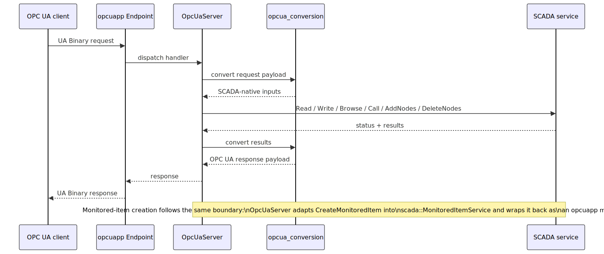

# OPC UA Module Design

This document describes the design of the shared `common/opcua/` module.

Related documents:

- [design.md](./design.md) for the broader common-library index
- [../README.md](../README.md) for the top-level common-library overview

## Diagrams

### Module Overview

Source: [opcua_module_overview.mmd](./opcua_module_overview.mmd)

### Server Request Flow

Source: [opcua_server_request_flow.mmd](./opcua_server_request_flow.mmd)

### Client Session Flow

Source: [opcua_client_session_flow.mmd](./opcua_client_session_flow.mmd)

## Purpose

The shared OPC UA module supplies both sides of the project's classic UA TCP
integration:

- server-side endpoint hosting through `OpcUaModule` and `OpcUaBinaryServer`
- client-side outbound UA sessions through `OpcUaSession`
- conversion between OPC UA C-stack types and SCADA-native service types
- monitored-item and event subscription bridging
- a `DataServicesFactory` adapter that exposes an outbound UA session as the
  standard SCADA service interfaces
- the canonical transport-neutral OPC UA request/response and coroutine
  service-dispatch model now reused by both the Binary and WS server adapters

At runtime it sits between:

- the OPC Foundation ANSI C stack wrapped by `opcuapp`
- the shared SCADA service interfaces such as `AttributeService`,
  `ViewService`, `MethodService`, and `MonitoredItemService`
- the server module in `server/opcua/`
- client-side callers that want to talk to a remote OPC UA endpoint through
  the same service abstractions used elsewhere in the codebase

## Main Components

### `OpcUaModule` / `OpcUaBinaryServer`

Files:

- `server/opcua/opcua_module.cpp`
- `common/opcua/binary/opcua_binary_server.h`
- `common/opcua/binary/opcua_binary_server.cpp`

Server-side TCP listener and connection host for the transport-backed OPC UA
binary runtime.

Responsibilities:

- parse and validate the `opc.tcp://` endpoint configuration
- open and close the passive TCP listener
- host the UA binary frame server on accepted transports
- wire the listener to the shared `opcua::OpcUaBinaryRuntime`

Business logic, session state, and service dispatch live below this layer in
the shared runtime model rather than in a transport-specific server bridge.

### `OpcUaSession`

Files:

- `common/opcua/opcua_session.h`
- `common/opcua/opcua_session.cpp`

Client-side UA session adapter that implements the shared SCADA service
interfaces on top of an outbound OPC UA channel and session.

Responsibilities:

- connect a client channel and session to a remote `opc.tcp://` endpoint
- expose browse, read, write, method-call, and monitored-item operations
  through the shared service interfaces
- keep the default subscription alive for monitored-item traffic
- translate channel/session failures into the shared status model

The current implementation keeps reconnect and disconnect behavior minimal,
but it already establishes the core adapter boundary used by
`CreateOpcUaServices(...)`.

### `OpcUaSubscription`

Files:

- `common/opcua/opcua_subscription.h`
- `common/opcua/opcua_subscription.cpp`

Client-side monitored-item manager layered on one OPC UA subscription.

Responsibilities:

- create the default OPC UA subscription for `OpcUaSession`
- batch monitored-item subscribe and unsubscribe operations
- route data-change notifications into `scada::DataChangeHandler`
- route event notifications into `scada::EventHandler`
- propagate subscription-level failures back through the session error path

This is the layer that makes the shared `scada::MonitoredItem` abstraction
look like native OPC UA subscriptions and monitored items.

### `opcua_conversion.*`

Files:

- `common/opcua/opcua_conversion.h`
- `common/opcua/opcua_conversion.cpp`
- `common/opcua/opcua_conversion_unittest.cpp`

Type-conversion layer between OPC UA C-stack structs and SCADA-native types.

Responsibilities:

- convert scalar and structured values such as `Variant`, `DataValue`,
  `NodeId`, `ExpandedNodeId`, `QualifiedName`, and `LocalizedText`
- convert browse, method, node-management, monitoring, and event-filter
  payloads
- normalize status-code translation between the two type systems

This conversion layer is shared by both the server runtime and `OpcUaSession`, so
service logic and tests can stay on the SCADA-native type model.

### Shared server runtime model

Files:

- `common/opcua/opcua_message.h`
- `common/opcua/opcua_service_message.h`
- `common/opcua/opcua_service_handler.{h,cpp}`
- `common/opcua/opcua_server_session_manager.{h,cpp}`
- `common/opcua/opcua_server_session.{h,cpp}`
- `common/opcua/opcua_server_subscription.{h,cpp}`
- `common/opcua/opcua_runtime.{h,cpp}`
- `common/opcua/websocket/opcua_ws_runtime.h`

Canonical server-side request/response and service-dispatch contract used by
both the UA Binary adapter and the UA-JSON/WebSocket adapter.

Responsibilities:

- define the transport-neutral `opcua::OpcUaRequestBody` /
  `opcua::OpcUaResponseBody` model for session, subscription, publish, browse,
  and service operations
- own the canonical shared server-session lifecycle, subscription runtime,
  publish arbitration, republish cache, and browse continuation handling in
  `common/opcua/`, with the WS module retaining compatibility aliases only
- expose `opcua::OpcUaServiceHandler` as the shared coroutine dispatcher into
  `AttributeService`, `ViewService`, `HistoryService`, `MethodService`, and
  `NodeManagementService`
- keep WS-specific envelope handling outside the runtime so Binary and WS meet
  the same semantic core at the same abstraction layer
- keep the remaining Binary-specific adapter layer in
  `opcua_binary_service_dispatcher` focused on request decode / response
  encode and the few response encoders that still need Binary-only wire
  metadata such as `HistoryReadEvents`, with `OpcUaBinaryRuntime` owning
  Binary session-token lookup and authenticated canonical request dispatch
  over the transport-neutral `opcua::` request/response types, with
  `OpcUaBinary*` names retained as compatibility aliases at the adapter edge
- define the transport-neutral runtime contract-test scenarios in
  `opcua_runtime_contract_test.h`, then execute them against the canonical
  runtime plus the Binary and WS adapter runtimes so semantic parity stays
  covered during further unification

### `CreateOpcUaServices(...)`

File:

- `common/opcua/opcua_services_factory.cpp`

Factory adapter that exposes one outbound `OpcUaSession` through the shared
`DataServices` bundle.

Responsibilities:

- construct `OpcUaSession`
- publish that session as the `session`, `view`, `attribute`, `method`, and
  `monitored-item` service surface
- shield callers from `OpcUaSession` construction failures

## Runtime Composition

The shared OPC UA pieces are wired in two main ways:

1. The server creates `server/opcua/OpcUaModule`.
2. `OpcUaModule` loads endpoint settings from `server.json`.
3. `OpcUaModule` constructs the shared `OpcUaBinaryRuntime` and
   `OpcUaSessionManager`.
4. `OpcUaBinaryServer` opens the `opc.tcp://` endpoint and routes inbound UA
   traffic into that shared runtime.

Separately:

1. A caller invokes `CreateOpcUaServices(...)`.
2. The factory constructs `OpcUaSession`.
3. `OpcUaSession` exposes browse, read, write, call, and monitored-item
   operations through the shared service interfaces.
4. `OpcUaSession` lazily creates `OpcUaSubscription` when monitored items are
   requested.

## Request Flows

### Server-side Request Handling

1. A UA client sends a binary request to the `opc.tcp://` endpoint.
2. `OpcUaBinaryServer` decodes frames and hands the service payload to the
   shared binary runtime.
3. The shared runtime converts the request payload into SCADA-native types.
4. The corresponding shared service performs the real read, write, browse,
   method, or node-management work.
5. The shared runtime converts the result back into OPC UA response types.
6. `OpcUaBinaryServer` writes the response back to the UA client.

### Client-side Session Handling

1. A caller creates the shared data-services bundle through
   `CreateOpcUaServices(...)`.
2. `OpcUaSession::Connect(...)` opens a UA channel and then creates and
   activates a UA session.
3. Reads, writes, browse calls, and method calls use that active session.
4. The first monitored-item request lazily creates `OpcUaSubscription`.
5. The subscription batches monitored-item operations and forwards live
   updates back into the shared monitored-item handlers.

## Cross-Module Boundaries

- The server-side `server/opcua/OpcUaModule` owns configuration loading and
  endpoint lifecycle, while the shared `common/opcua/` runtime owns protocol
  adaptation.
- Any future sibling transport should reuse the same SCADA service model
  rather than adding another transport-specific server bridge.
- The shared conversion layer is also the natural place to keep any future
  UA transport siblings consistent on SCADA-native type semantics.

## Transport-Neutral Ownership Rules

The shared `common/opcua/` server runtime is the semantic source of truth for
server-side OPC UA behavior used by both the Binary and WS adapters.

- session lifecycle, subscription ownership, publish behavior, republish
  caching, browse continuation handling, and coroutine service dispatch belong
  in `common/opcua/`
- Binary-specific concerns stay in the Binary adapter layer:
  UA Binary / UACP framing, SecureChannel/TCP integration, request-header
  adaptation, and response encoders that require Binary-only wire metadata
- WS-specific concerns stay in `common/opcua/websocket/`:
  UA-JSON envelope handling, WebSocket/WSS transport policy, browser-origin
  checks, and JSON codec behavior
- the design does not require merging Binary and WS wire codecs, sharing
  handshake logic, or forcing the transports onto one framing model

When Binary and WS differ on OPC UA semantics, the source of truth is the OPC
Foundation specification rather than historical in-repo behavior. That check is
especially important for session lifecycle, publish/keep-alive/republish,
`TransferSubscriptions`, monitored-item initial-value behavior,
`BrowseNext` continuation handling, and Binary-vs-JSON field-level mismatches.
