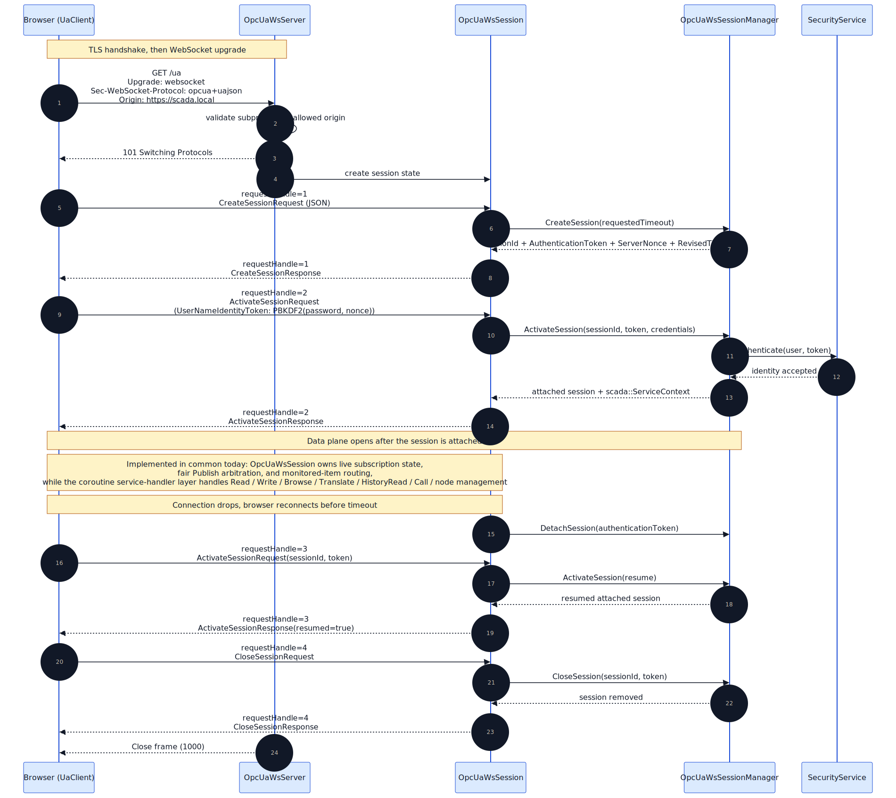
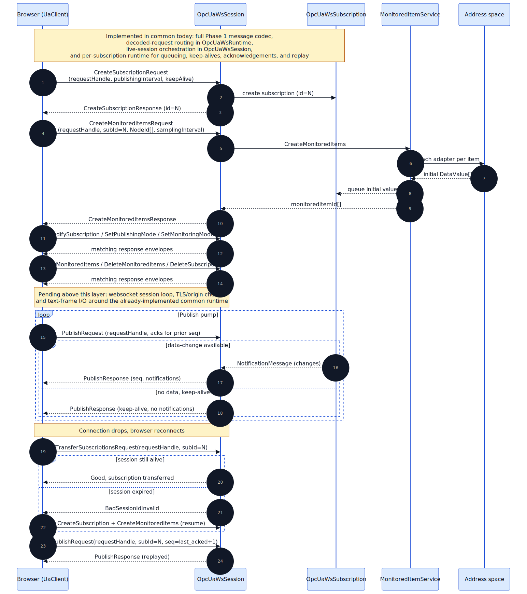

# OPC UA over WebSocket Endpoint

> Status: partly implemented. The transport/session endpoint described here
> does not yet exist, but the transport-independent `common/opcua_ws/`
> service-dispatch layer is now present and uses coroutine-based handlers for
> the currently implementable Phase 0/2/3 service set: `Read`, `Write`,
> `Browse`, `BrowseNext`, `TranslateBrowsePathsToNodeIds`, `HistoryRead`, `Call`,
> `AddNodes`, `DeleteNodes`, `AddReferences`, and `DeleteReferences`. A
> transport-independent session lifecycle manager for `CreateSession`,
> `ActivateSession`, `DetachSession`, and `CloseSession` is also present. The
> matching UA-JSON codec now covers the protocol envelope
> (`requestHandle` + `service` + `body`), session request/response messages,
> `ServiceFault`, the implemented service-dispatch set, and the full Phase 1
> subscription message set
> (`CreateSubscription`, `ModifySubscription`, `SetPublishingMode`,
> `Publish`, `Republish`, `DeleteSubscriptions`, `TransferSubscriptions`,
> `CreateMonitoredItems`, `ModifyMonitoredItems`, `DeleteMonitoredItems`,
> `SetMonitoringMode`), all with unit tests. A transport-independent
> per-subscription runtime is also now present for monitored-item binding,
> notification queueing, keep-alive generation, ack/replay handling, and
> event-field projection. A transport-independent `OpcUaWsSession` layer now
> also owns subscription ids, monitored-item routing, fair publish arbitration
> across subscriptions, and in-memory transfer handoff between session
> instances. A transport-independent `OpcUaWsRuntime` layer now routes decoded
> request envelopes through `OpcUaWsSessionManager`, `OpcUaWsSession`, and the
> coroutine service handler, including detach/resume and subscription transfer
> ownership tracking across live sessions. A message-oriented
> `OpcUaWsServer` loop is now also present for accepted transports: it reads
> request frames, decodes UA-JSON envelopes, dispatches them through
> `OpcUaWsRuntime`, writes responses, and detaches sessions on disconnect. The
> remaining common-side gap is the final Beast WSS/TLS/origin wrapper around
> that server loop.

## Related documents

- [../../server/docs/design.md](../../server/docs/design.md) — overall server architecture
- `common/opcua/opcua_server.{h,cpp}` — the existing `opc.tcp://` endpoint that
  this module sits next to
- [./opcua_module.md](./opcua_module.md) —
  design of the existing shared OPC UA TCP client/server layer
- [../../web/docs/design.md](../../web/docs/design.md) — the web client that
  is the primary consumer of this endpoint
- [../../web/docs/opcua-client.md](../../web/docs/opcua-client.md) — the
  browser-side TS OPC UA client library and wire-format counterpart

## Diagrams

### Module architecture



Source: [opcua_ws_architecture.mmd](./opcua_ws_architecture.mmd)

### Session lifecycle



Source: [opcua_ws_session_sequence.mmd](./opcua_ws_session_sequence.mmd)

### Subscription and publish loop



Source: [opcua_ws_subscription_sequence.mmd](./opcua_ws_subscription_sequence.mmd)

## Motivation

The existing OPC UA endpoint at `common/opcua/opcua_server.cpp` is built on
the OPC Foundation ANSI C stack via `opcuapp`. It opens endpoints through
`OpcUa_Endpoint_Open("opc.tcp://...")`, which wires up a TCP listener and the
UA binary secure-channel protocol. That stack has no WebSocket listener, so
browsers cannot reach it directly.

Rather than inserting a translation gateway between the browser and the C++
server, we add a **sibling** OPC UA endpoint that speaks the UA WebSocket
transport the spec already defines. The address space, monitored items,
history, events, and security decisions all stay in scada-server — the new
endpoint is pure transport and encoding.

## Transport choice: UA-JSON over WebSocket

Subprotocol: `opcua+uajson`. This is the JSON WebSocket mapping defined in
OPC UA Part 6 §5.4 (Reversible JSON Encoding) and §7.4 (WebSocket transport
mapping).

Chosen over UA Binary over WS (`opcua+uacp`) because:

- **Browser feasibility.** A UA Binary encoder/decoder in the browser has to
  cover every Variant type, ExtensionObject, NodeId encoding, and secure-channel
  chunking. That is weeks of TypeScript plus a WASM UA stack. UA-JSON is
  parseable with built-in `JSON.parse`; the reversible-JSON schema lets us
  hand-roll a focused encoder/decoder in ~2 k lines.
- **Debuggability.** JSON frames are inspectable in Chrome DevTools and in
  packet captures. UA binary is opaque without a dissector.
- **Closed loop.** Both endpoints are ours. We are not trying to interoperate
  with arbitrary UA clients on the WS endpoint; the TCP endpoint stays there
  for anything that needs binary.

Tradeoff accepted: JSON payloads are larger. We mitigate with Beast's
`permessage-deflate`, which typically recovers most of the gap on repetitive
`DataValue` traffic.

## Placement

New modules, none of which touch the existing `common/opcua/` code:

| Path | Role |
|---|---|
| `common/opcua_ws/opcua_ws_server.{h,cpp}` | Message-oriented accept/session loop over `transport::any_transport`: reads JSON frames, dispatches through `OpcUaWsRuntime`, writes responses, detaches sessions on disconnect |
| `common/opcua_ws/opcua_ws_session.{h,cpp}` | Transport-independent live session state: subscription ids, monitored-item routing, fair publish arbitration, browse continuation-point paging, and transfer handoff between live sessions |
| `common/opcua_ws/opcua_ws_runtime.{h,cpp}` | Transport-independent request router: decoded envelope dispatch, session attach/resume, global subscription ownership, and service-handler/session-manager wiring |
| `common/opcua_ws/opcua_ws_session_manager.{h,cpp}` | Transport-independent session lifecycle, resume/detach timeout handling, and auth-policy enforcement |
| `common/opcua_ws/opcua_ws_subscription.{h,cpp}` | Publish queue, keep-alive timer, data-change delivery; mirrors `MonitoredItemAdapter` at `common/opcua/opcua_server.cpp:196-230` |
| `common/opcua_ws/opcua_json_codec.{h,cpp}` | UA-JSON encode/decode over `boost::json`; reuses `common/opcua/opcua_conversion.{h,cpp}` for UA ↔ scada conversion |
| `common/opcua_ws/opcua_ws_message.h` + `common/opcua_ws/opcua_ws_message_codec.cpp` + `common/opcua_ws/opcua_ws_subscription_message_codec.cpp` + `common/opcua_ws/opcua_ws_publish_message_codec.cpp` | Transport-neutral WS protocol envelope types and codec: `requestHandle`, session request/response bodies, `ServiceFault`, and the full Phase 1 subscription / publish / monitored-item message set |
| `common/opcua_ws/opcua_ws_service_handler.{h,cpp}` | Coroutine-based dispatch from decoded WS service requests into existing `AttributeService`, `ViewService`, `HistoryService`, `MethodService`, and `NodeManagementService` |
| `common/opcua_ws/*_unittest.cpp` | Codec golden fixtures, session lifecycle, subscription publish/ack, service-dispatch coverage |
| `server/opcua_ws/opcua_ws_module.{h,cpp}` | Config loader + lifecycle; templated on `server/opcua/opcua_module.cpp` |

The new endpoint reuses the same `OpcUaServerContext` service collaborators
the TCP endpoint already closes over:

- `AttributeService` — Read, Write, HistoryRead
- `ViewService` — Browse, BrowseNext, TranslateBrowsePathsToNodeIds
- `MonitoredItemService` — CreateMonitoredItems, subscription delivery
- `MethodService` — Call
- `NodeManagementService` — AddNodes, DeleteNodes, AddReferences, DeleteReferences

No business logic is reimplemented. The WS endpoint is decode-JSON →
coroutine handler → encode-JSON.

## Framing

- Boost.Beast `websocket::stream<ssl::stream<tcp::socket>>`.
- TLS handles channel security, so we do **not** run UA `OpenSecureChannel`.
  The WebSocket upgrade is the secure-channel establishment.
- One WebSocket **text** frame carries one UA request or response JSON object
  (Part 6 §7.4 simple framing). In the current common-side codec, that frame
  is represented as a transport-neutral envelope with `requestHandle`,
  `service`, and `body`. `requestHandle` correlates responses; future
  `PublishResponse` messages are pushed by the server in response to
  outstanding `PublishRequest` messages, same pattern as on TCP.
- Handshake validates `Sec-WebSocket-Protocol: opcua+uajson` and `Origin`
  against a configured allowlist. This is the cross-site WebSocket hijacking
  (CSWSH) guard — `Origin` is the only signal the browser is honest about for
  same-origin policy on WebSockets.
- Keep-alive: WebSocket ping/pong at 30 s in addition to the UA subscription
  keep-alive. Ping failure triggers `ws::close` with status 1011 and tears
  down the UA session after its normal timeout (so `TransferSubscriptions` on
  reconnect still works if the client races back fast enough).

## Authentication

On `ActivateSessionRequest`, `OpcUaWsSession` constructs the same
`scada::ServiceContext` the TCP endpoint constructs. Identity tokens
supported in Phase 0:

- `AnonymousIdentityToken` — accepted only when the server is configured for
  anonymous access.
- `UserNameIdentityToken` — password is delivered as
  `PBKDF2-SHA-256(password, server_nonce)` per the UA spec. TLS already
  protects the channel; the PBKDF layer prevents regressions when someone
  disables TLS in a dev environment and also matches what native UA clients
  send.

The server-side auth path (`server/security/`) is unchanged.

## Configuration

Add an `opcua_ws` block to both `server/data/server.json` and
`server/docker/server.json`:

```jsonc
"opcua_ws": {
  "enabled": true,
  "url": "opc.wss://0.0.0.0:4843",
  "server_private_key": "${DIR_PARAM}/Certificates/ServerPrivateKey.pem",
  "server_certificate": "${DIR_PARAM}/Certificates/ServerCertificate.pem",
  "allowed_origins": ["http://localhost:5173"],
  "subprotocol": "opcua+uajson",
  "max_message_size": 4194304,
  "compression": true,
  "trace": "warning"
}
```

Notes:

- Port `4843` is the UA spec's recommendation for WSS. Keeping the TCP
  endpoint on `4840` means both can run simultaneously.
- `allowed_origins` defaults to an empty list — that is, deny by default in
  prod. Explicit `"*"` is accepted for lab setups but logs a warning at
  startup.
- TLS certs intentionally reuse the same paths as the legacy OPC UA endpoint
  so ops manage one cert rotation, not two.
- `max_message_size` bounds both directions; over-large messages close the
  socket with status 1009.

## Phased service coverage

The module is built incrementally. Each phase gates a corresponding phase of
the [web client roadmap](../../web/docs/roadmap.md).

| Phase | UA services live on WS | Drives web feature |
|---|---|---|
| 0 | `CreateSession`, `ActivateSession`, `CloseSession`, `Read`, `Write`, `Browse`, `BrowseNext`, `TranslateBrowsePathsToNodeIds` | Login, address-space tree, timer-polled watch |
| 1 | `CreateSubscription`, `ModifySubscription`, `SetPublishingMode`, `Publish`, `Republish`, `DeleteSubscriptions`, `TransferSubscriptions`, `CreateMonitoredItems`, `ModifyMonitoredItems`, `SetMonitoringMode`, `DeleteMonitoredItems` | Subscription-driven watch, event journal, alarms |
| 2 | `HistoryRead` (raw + events), `Call` | Trend graphs, method-based control commands |
| 3 | `AddNodes`, `DeleteNodes`, `AddReferences`, `DeleteReferences` | Bulk create, configuration table editors |

All of these handlers already exist server-side. The WS work per phase is
adding the JSON codec paths, wiring the dispatch table, and extending the
session/subscription state machines.

Current implementation note:

- The coroutine service-dispatch layer for the transport-independent Phase 0
  request set that maps directly to existing `AttributeService` /
  `ViewService` APIs is in place under
  `common/opcua_ws/opcua_ws_service_handler.{h,cpp}`:
  `Read`, `Write`, `Browse`, and `TranslateBrowsePathsToNodeIds`.
- The transport-independent session lifecycle layer is in place under
  `common/opcua_ws/opcua_ws_session_manager.{h,cpp}` with coroutine entry
  points for `CreateSession` and `ActivateSession`, synchronous
  `DetachSession` / `CloseSession`, revised timeout enforcement, detachable
  resume semantics, and single-session auth policy checks.
- The UA-JSON protocol envelope and session wire-format mapping are in place
  under `common/opcua_ws/opcua_ws_message.h` and
  `common/opcua_ws/opcua_ws_message_codec.cpp`, covering
  `CreateSessionRequest/Response`, `ActivateSessionRequest/Response`,
  `CloseSessionRequest/Response`, `ServiceFault`, and `requestHandle`
  correlation on top of the already-implemented service request/response
  codec.
- The transport-independent Phase 1 subscription / monitored-item lifecycle
  wire-format is now in place under
  `common/opcua_ws/opcua_ws_subscription_message_codec.cpp`, covering
  `CreateSubscription`, `ModifySubscription`, `SetPublishingMode`,
  `DeleteSubscriptions`, `CreateMonitoredItems`, `ModifyMonitoredItems`,
  `DeleteMonitoredItems`, and `SetMonitoringMode` request/response envelopes
  with unit tests.
- The transport-independent Phase 1 publish / replay / transfer wire-format is
  now in place under `common/opcua_ws/opcua_ws_publish_message_codec.cpp`,
  covering `Publish`, `Republish`, and `TransferSubscriptions` request/response
  envelopes plus notification payloads (`DataChangeNotification`,
  `EventNotificationList`, `StatusChangeNotification`) with unit tests.
- The transport-independent per-subscription Phase 1 runtime is now in place
  under `common/opcua_ws/opcua_ws_subscription.{h,cpp}` with unit tests. It
  binds monitored items through `MonitoredItemService`, maintains per-item
  notification queues, emits keep-alive `PublishResponse`s while publishing is
  enabled, tracks retransmit state for `Republish`, applies acknowledgements,
  ignores stale callbacks after monitored-item rebind/delete, and projects the
  default browser event-field set (`EventId`, `EventType`, `SourceNode`,
  `SourceName`, `Time`, `Message`, `Severity`) from `scada::Event` payloads.
- The transport-independent live-session Phase 1 runtime is now in place under
  `common/opcua_ws/opcua_ws_session.{h,cpp}` with unit tests. It owns
  subscription creation / deletion, routes monitored-item operations to the
  correct subscription, aggregates `PublishRequest` acknowledgements, drains
  subscriptions fairly in round-robin order, primes and forwards keep-alives,
  can transfer live subscription ownership between session instances
  in-memory, and now also pages `Browse` results into session-scoped
  continuation points consumed or released through `BrowseNext`.
- The transport-independent decoded-request router is now in place under
  `common/opcua_ws/opcua_ws_runtime.{h,cpp}` with unit tests. It ties
  `OpcUaWsSessionManager`, `OpcUaWsSession`, and `OpcUaWsServiceHandler`
  together for decoded WS envelopes: `CreateSession` / `ActivateSession` /
  `CloseSession`, subscription and monitored-item messages, `Publish` /
  `Republish`, detach/resume on reconnect, and the already-implemented Phase
  0/2/3 service-dispatch set. It also tracks subscription ownership globally
  so `TransferSubscriptions` can move subscriptions between live sessions
  without direct session references at the call site.
- The message-oriented accepted-transport server loop is now in place under
  `common/opcua_ws/opcua_ws_server.{h,cpp}` with unit tests. It opens an
  accepted transport, reads framed JSON messages, decodes
  `OpcUaWsRequestMessage`, dispatches through `OpcUaWsRuntime`, encodes
  `OpcUaWsResponseMessage`, writes the reply, emits `ServiceFault` on malformed
  JSON, and detaches session state on disconnect.
- The coroutine service-dispatch layer for Phase 2 and Phase 3 is in place
  under `common/opcua_ws/opcua_ws_service_handler.{h,cpp}` with unit tests.
- The UA-JSON codec for that same implemented set is in place under
  `common/opcua_ws/opcua_json_codec.{h,cpp}` with round-trip unit coverage for
  Phase 0 `Read` / `Write` / `Browse` / `BrowseNext` /
  `TranslateBrowsePathsToNodeIds` and
  Phase 2/3 `HistoryRead` / `Call` / node-management payloads. The generic
  `Variant` codec there now also supports opaque scalar and array
  `ExtensionObject` payloads via `{typeId, body}` JSON objects so the WS layer
  can round-trip structured values without a typed registry yet.
- The remaining work is now the actual websocket handshake/security boundary:
  Beast WSS acceptor/session classes, TLS and `Origin` enforcement,
  `Sec-WebSocket-Protocol` validation, ping/pong lifecycle, and adapting that
  accepted socket layer onto the now-implemented message-oriented
  `OpcUaWsServer`.
- Socket/session management at the transport layer and the actual
  `server/opcua_ws/` module remain pending.

## Test strategy

### Codec

`common/opcua_ws/opcua_json_codec_unittest.cpp`

Golden-fixture tests for `Variant`, `NodeId`, `ExpandedNodeId`,
`QualifiedName`, `LocalizedText`, `DataValue`, and each request/response pair
implemented in the current phase. Current coverage now includes the
transport-independent Phase 0 payloads (`CreateSession`, `ActivateSession`,
`CloseSession`, `Read`, `Write`, `Browse`, `BrowseNext`,
`TranslateBrowsePathsToNodeIds`) plus the implemented Phase 1 subscription /
monitored-item lifecycle payloads
(`CreateSubscription`, `ModifySubscription`, `SetPublishingMode`,
`Publish`, `Republish`, `DeleteSubscriptions`, `TransferSubscriptions`,
`CreateMonitoredItems`, `ModifyMonitoredItems`, `DeleteMonitoredItems`,
`SetMonitoringMode`) and the existing Phase 2/3 payloads actually wired into
`OpcUaWsServiceHandler`, all wrapped in the common request/response envelope
with `requestHandle`. `ServiceFault` is also covered, and `Variant`
`ExtensionObject` values now round-trip opaquely via `{typeId, body}`. The
remaining gaps are the actual websocket transport/session layer and the
browser-facing Beast integration.

### Session lifecycle

`common/opcua_ws/opcua_ws_session_manager_unittest.cpp`

- Create → Activate → Close happy path
- Anonymous activate uses revised timeout without invoking authentication
- Activate without prior Create → `Bad_SessionIsLoggedOff`
- Session timeout expiry without Activate → session cleaned up
- `DetachSession` + `ActivateSession` with valid token → resumes
- `ActivateSession` with expired session → `Bad_SessionIsLoggedOff`
- Single-session identities require `deleteExisting=true` to replace an
  existing active session

### In-process integration

`common/opcua_ws/opcua_ws_service_handler_unittest.cpp`

Covers the coroutine dispatch layer for:

- `Read`
- `Write`
- `Browse`
- `TranslateBrowsePathsToNodeIds`
- `HistoryReadRaw`
- `HistoryReadEvents`
- `Call`
- `AddNodes`
- `DeleteNodes`
- `AddReferences`
- `DeleteReferences`

`common/opcua_ws/opcua_ws_subscription_unittest.cpp`

Covers the transport-independent per-subscription runtime for:

- data-change publish delivery
- acknowledgement and `Republish` replay behavior
- keep-alive generation
- publishing-disabled queue retention
- event-field projection from event filters
- monitored-item rebind/delete safety against stale callbacks

`common/opcua_ws/opcua_ws_session_unittest.cpp`

Covers the transport-independent live-session runtime for:

- subscription creation and deletion
- monitored-item request routing
- browse continuation-point paging and `BrowseNext` release/resume
- round-robin publish arbitration across subscriptions
- acknowledgement aggregation and `Republish`
- keep-alive priming at the session layer
- in-memory `TransferSubscriptions` ownership handoff

`common/opcua_ws/opcua_ws_runtime_unittest.cpp`

Covers the transport-independent decoded-request runtime for:

- envelope routing through activated sessions
- `Browse` paging and `BrowseNext` continuation-point routing
- detach/resume preserving live subscription state
- `TransferSubscriptions` via global subscription ownership
- `CloseSession` removing live runtime state

`common/opcua_ws/opcua_ws_server_unittest.cpp`

Covers the message-oriented server loop for:

- request decode / runtime dispatch / response encode
- malformed JSON mapping to `ServiceFault`
- disconnect-driven session detach and later resume
- acceptor open/close lifecycle

`common/opcua_ws/opcua_ws_e2e_test.cpp`

Spins the WS endpoint bound to a loopback port with an in-memory address
space fixture, opens a Beast WebSocket client, and drives the Phase 0
service set end-to-end. No real UA client, no browser, no `server.exe`
launch. This is the test that catches regressions in the message dispatch
and in the Beast integration.

### Playwright e2e

The full browser-against-server e2e lives in the web submodule
(`web/apps/e2e/`) and launches the real `server.exe` with
`opcua_ws.enabled=true`. See
[../../web/docs/build.md](../../web/docs/build.md) for the CI lane
(`web-e2e.yml`) that runs it.

## Out of scope

- UA Binary over WebSocket (`opcua+uacp`). Could be added later as a third
  endpoint without changing this design; no current consumer asks for it.
- UA Discovery (`FindServers`, `GetEndpoints`) over JSON. Hardcode endpoint
  details in the web client for Phase 0; revisit if a non-browser UA client
  starts consuming the WS endpoint.
- UA SecureChannel over WS. TLS is the channel; we do not layer UA's own
  secure-channel framing on top.
