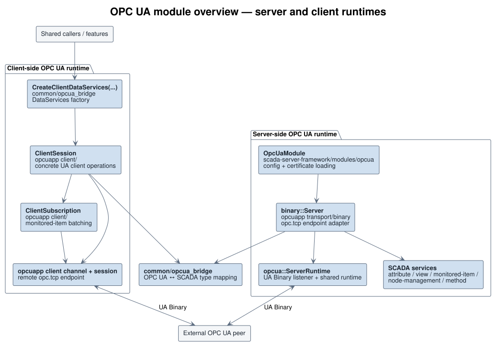
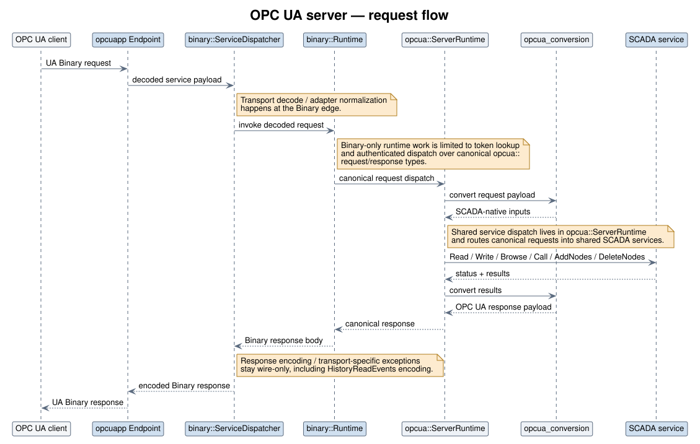
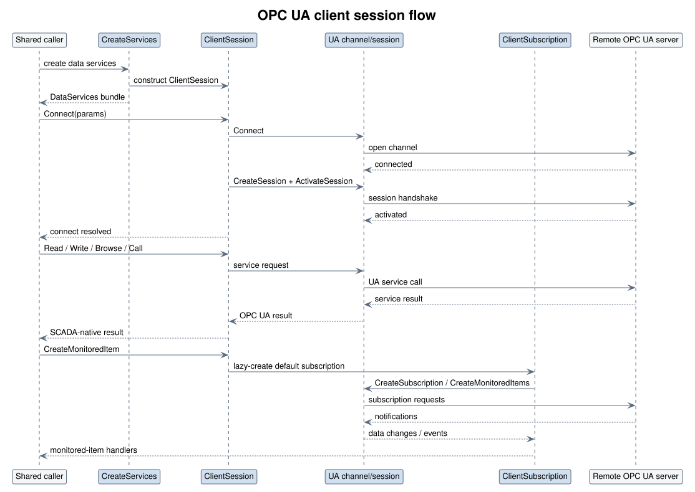

# Common Architecture

Status: Living reference
Last verified against code: 2026-09-21 (the "Browse reference-type filtering"
section only, written against the five predicates it names. The "OPC UA Module"
section was last verified 2026-08-31, rewritten after that module left
`common/` for three separate homes. The rest of this index is unverified — this
document carried no date before 2026-08-31, so treat the other sections as
unchecked rather than as recently confirmed.)

This document indexes the shared `common/` libraries used by both the SCADA
server and client.

Related documents:

- [../README.md](../README.md) for the top-level common-library overview
- [./opcua.md](./opcua.md) for the shared OPC UA transport and
  conversion layer
- [./node_service.md](./node_service.md) for the NodeService design
  (bounded residency, immutable NodeState snapshots)

## Modules

| Module | Purpose |
|--------|---------|
| `common/` | Core utilities, data services, node state, expression engine |
| `address_space/` | OPC UA address space nodes, hierarchy, and builder |
| `events/` | Event storage, aggregation, and event subscriptions |
| `node_service/` | Node access abstraction layers and proxy implementations |
| `opcua/` | OPC UA conversion layer plus client/server/session wrappers |
| `timed_data/` | Time-series data with aliases and computed expressions |
| `opc/` | Classic COM-based OPC conversions (Windows only) |
| `vidicon/` | Vidicon telemetry integration (Windows only) |

## Browse reference-type filtering

**An unspecified `referenceTypeId` means every reference, and `includeSubtypes`
is ignored.** Both services that take one say so:

- OPC UA Part 4 §5.9.2.2 Parameters (Browse) —
  <https://reference.opcfoundation.org/Core/Part4/v105/docs/5.9.2.2> — "If not
  specified then all References are returned and includeSubtypes is ignored."
- OPC UA Part 4 §7.30 RelativePath —
  <https://reference.opcfoundation.org/Core/Part4/v105/docs/7.30> — "If the
  referenceTypeId is null then all References are included and the parameter
  includeSubtypes is ignored."

The rule is not free: without an explicit branch a null filter matches
**nothing**, because the subtype walk looks for a null id in a supertype chain
and never finds one while the exact-id compare fails too. The service then
answers `Good` with an empty reference list, and a caller cannot distinguish
"this node has no references" from "your filter matched nothing" — which is
what made the defect survive from the first Browse implementation until
2026-09-21 (backlog 675, measured against the deployed demo on 2026-08-30:
browsing `i=85` with no filter returned zero references where the same browse
naming `HierarchicalReferences` returned 15).

**`BrowseDescription::reference_type_id` default-constructs to a null NodeId**,
so the spec-correct "all references" request is also the default-constructed
one. That is why nothing internal ever tripped over it: in-tree callers name a
reference type, and only a service request arrives unfiltered.

Five predicates decide it, and each carries the branch and the citation:

| Predicate | Where | Reached from |
|---|---|---|
| `IsRefSubtypeOf` | `address_space/node_utils.cpp` | `FilterReferences`, so Browse **and** TranslateBrowsePaths |
| `SyncViewServiceImpl::BrowseProperty` | `address_space/view_service_impl.cpp` | a browse of a nested property |
| `WantsReference` (AddressSpace) | `address_space/address_space_util.cpp` | the framework's `browse_util.h` |
| `WantsReference`, `WantsReferenceOfSupertype`, `MightWantReferenceSubtype` (TypeSystem) | `common/type_system_util.h` | the framework's node managers, and the iec61850 / opc / filesystem tiers |

The last row is the one to be careful with: those predicates live in `common`
and have **no consumer in `common` at all**. `type_system_util_unittest.cpp`
is therefore the only thing that checks them, and it checks the predicate
rather than any node manager's end-to-end answer.

**That half is uncovered in both directions, which is a stronger statement
than "this product cannot see it" and is the one to act on.** Measured
2026-09-21 across the seven consumers — `node_manager/static/browse_util.h`,
`node_manager/static/node_state_models.h`,
`node_manager/static/static_node_manager.h`,
`node_manager/aggregate/aggregate_node_manager.cpp`,
`node_manager/configuration/database_call.cpp`, and the `opc` and
`filesystem` tiers' `*_node_models.h` — **every** `BrowseDescription` any of
their tests builds names a reference type. So the framework suite passing
says only that nothing there asserted the old behaviour; nothing asserts the
new one either, and a regression would be silent. Nothing prevents such a
test: `root_node_manager_unittest.cpp` already drives a real `RootNodeManager`
rather than a mock view service, so the fixture exists and nobody has written
the case. The `address_space` rows above are not in this position —
`ViewServiceImpl.BrowseWithoutAReferenceTypeReturnsEveryReference` browses a
real `SyncViewServiceImpl` over a real address space and asserts the reference
set that comes back.

Two things the rule deliberately does **not** relax. `browseDirection` is a
separate parameter and still applies, so an unfiltered inverse browse returns
inverse references only. And a reference whose type node is not resident in
the address space is still skipped, because `ReferenceDescription` has to
report `ref.type->id()`; the null-filter branch sits after that guard.

## OPC UA Module

The OPC UA boundary this section used to place in a single ~~`common/opcua/`~~
module is now split across three homes, and `common/` owns only the middle one:

| Where | What |
|---|---|
| `third_party/opcuapp/opcua/` | The self-contained UA stack: `binary::Server` for the `opc.tcp://` endpoint (`transport/binary/server.h`), the JSON-over-WebSocket transport (`transport/websocket/`), and `ClientSession` / `ClientSubscription` plus monitored-item plumbing for outbound sessions (`client/`). Namespaced `opcua::`, with no dependency on SCADA `core`. |
| `common/opcua_bridge/` | The adapter between the `scada::` and `opcua::` type universes: `conversion.h`, `service_conversion.h` and `vector_conversion.h` for the types; `server_adapters.h` to expose core services to opcuapp's server runtime; `client_adapters.h` to wrap an outbound `opcua::ClientSession` as core services, assembled by `CreateClientDataServices()`. See `common/opcua_bridge/README.md`. |
| `scada-server-framework/modules/opcua/` | `OpcUaModule` (`opcua_module.h`), which installs the server-side endpoint into a tier. |

`ExtensionObject` / `EventNotification` payloads are `std::any` and do not
cross the type boundary by value — the type id converts and the payload is left
empty, the wire codec carrying the body.

### Module Overview

Source: [opcua_module_overview.puml](./diagrams/opcua_module_overview.puml)

### Server Request Flow

Source: [opcua_server_request_flow.puml](./diagrams/opcua_server_request_flow.puml)

### Client Session Flow

Source: [opcua_client_session_flow.puml](./diagrams/opcua_client_session_flow.puml)

See also: [opcua.md](./opcua.md)
